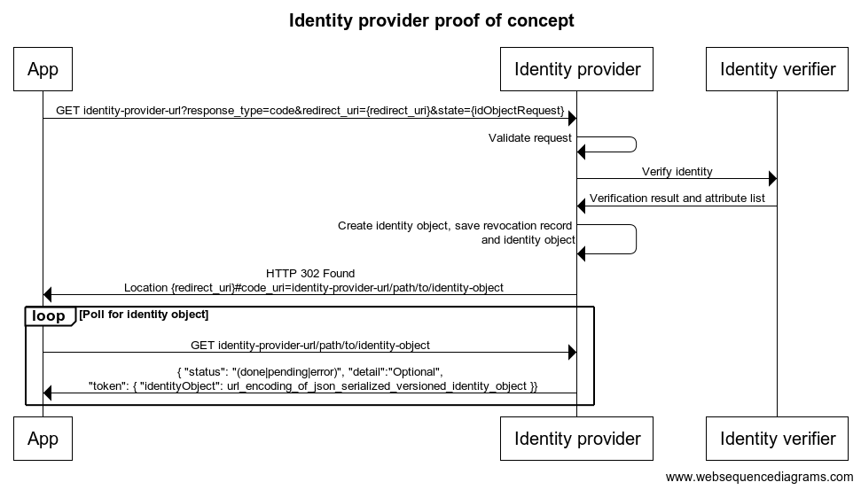

# Identity provider service

This module contains a proof of concept identity provider service which helps to show the flow that is required by
an identity provider. It uses the provided libraries from the crypto repository to verify the incoming request,
and after an identity verifier has verified the caller's identity, to create the identity object that the wallet can
then retrieve and use.

# How to build and run

To build the executables move to the identity-provider-service directory and run:

```cargo build --release```

## Identity provider service

Navigate next to the generated binary and run (remember to update paths to your files):

```console
./identity-provider-service --anonymity-revokers data/anonymity_revokers.json --identity-provider data/identity_provider.json --wallet-proxy-base url-for-wallet-proxy --retrieve-base identity-provider-service-base-url --global-context data/global.json
```

Here identity_provider_file.json points to the file path containing the JSON representation of the identity provider public and private keys.
The `anonymity_revokers_file.json` refers to a file containing the JSON
representation of the anonymity revoker's public keys. This list determines the
supported anonymity revokers.

### Configuration file examples

An example of each file type can be found in the [./data](./data) subdirectory.

## Identity verifier service

The identity verifier is a supporting service that verifies the real-life
identity of the user. In this POC we assume that the service has a REST API that
the provider uses. The identity provider redirects the caller, after it has
validated the cryptographic proofs, to the identity verifier, which would
then verify the real-life identity, by e.g., asking the user to take photos, and
provide documents. In the proof of concept the user can simply input all their
personal attributes manually, and the identity verifier will accept them without
challenging the information.

The identity verifier can be run by using:

```console
cargo run --release --bin identity-verifier -- --id-provider-url url-for-identity-provider-service --identity-provider-public data/identity_provider.pub.json
```

or directly running the binary `identity_verifier` in `./target/release/`.

## Testing with the wallet on Staging

It is possible to test identity creation using the proof of concept identity provider service locally. Build and run the
two services as described above. Install and run an Android emulator using Android 8 (it is not possible
to use Android 9 or above, as they prohibit HTTP communication by default, which this proof of concept relies on).
When creating a new identity select `Internal test` as this will forward the wallet to `10.0.2.2` which is how
the Android emulator calls the host machine.

## Exposed services

|Method|URL|Description|
|---|---|---|
|GET (+POST)|`http://[hostname]:[provider_port]/api/v0/identity`|The endpoint the wallet calls to initiate the version 0 identity creation flow. It performs validation of the incoming request and if valid forwards the user to the identity verifier service.|
|GET|`http://[hostname]:[provider_port]/api/v1/identity`|The endpoint the wallet calls to initiate the version 1 identity creation flow. It performs validation of the incoming request and if valid forwards the user to the identity verifier service.|
|GET|`http://[hostname]:[provider_port]/api/v1/recover`|The endpoint the wallet calls to initiate the version 1 identity recovery flow. It performs validation of the incoming request and if valid the URL for retrieving the identity object is returned.|
|GET|`http://[hostname]:[provider_port]/api/v0/identity/create/{base_16_encoded_id_cred_pub_hash}`|Endpoint that the identity verifier forwards the user to after having validated their attributes. If the user has created a valid set of attributes, then this endpoint will ensure that an identity is created.|
|GET|`http://[hostname]:[provider_port]/api/v1/identity/create/{base_16_encoded_id_cred_pub_hash}`|Endpoint that the identity verifier forwards the user to after having validated their attributes in the version 1 flow. If the user has created a valid set of attributes, then this endpoint will ensure that an identity is created.|
|GET|`http://[hostname]:[provider_port]/api/v0/identity/{base_16_encoded_id_cred_pub_hash}`|The endpoint that exposes access to created identity objects. The caller will be redirected to this URL after creation of an identity object, so that they can retrieve it.|
|GET|`http://[hostname]:[provider_port]/api/v1/identity/{base_16_encoded_id_cred_pub_hash}`|The endpoint that exposes access to created identity objects. The caller will be redirected to this URL after creation of an identity object, so that they can retrieve it.|
|GET|`http://[hostname]:[verifier_port]/api/{v0\|v1}/verify/{base_16_encoded_id_cred_pub_hash}/{signature}`|An endpoint that simulates an identity verifier. The endpoint presents an HTML form where the user can submit their attributes which will always be accepted. In a real world application the attributes would have to be verified.|
|POST|`http://[hostname]:[verifier_port]/api/submit/`|Accepts submissions from the HTML for served by the verifier. The attributes are saved to a file database. No verification of the attributes are performed for the POC.|
|GET|`http://[hostname]:[verifier_port]/api/verify/attributes/{id_cred_pub}`|Provides read access to saved attributes. The identity provider accesses this endpoint to get attributes, and assumes that if an attribute list exists, then the user has been verified successfully.|

The POST method is only there for historical reasons. The GET method is the one in use.

The following are endpoints added for testing purposes, and are not necessarily part of the reference implementation.

|Method|URL|Description|
|---|---|---|
|GET|`http://[hostname]:[provider_port]/api/{v0\|v1}/identity/fail/{base_16_encoded_id_cred_pub_hash}?delay={seconds_delay}`|Endpoint that the identity verifier forwards the user to for a failed identity. The delay parameter specifies how many seconds until the request should fail.|
|GET|`http://[hostname]:[provider_port]/api/identity/retrieve_failed/{delay_until}`| Endpoint that the identity verifier forwards the user to for a failed identity. delay\_until should be a unix timestamp (in seconds) and while current time before than delay_until, the response will be a pending token. |
|GET|`http://[hostname]:[provider_port]/api/broken/identity`| Endpoint that a user can use to simulate a bad request. Returns a status code 400.|


The `state` field of the initial `GET` request should be urlencoded string
containing valid JSON of the form
```json
{
    "idObjectRequest": {
        "v": 0,
        "value": {
            PreIdentityObject JSON
        }
    }
}
```
and `redirect_uri` should be a string.


The initial POST request should have content-type `application/json` and the body should be a JSON object in the format
```json
{
    "idObjectRequest": {
        "v": 0,
        "value": {
            PreIdentityObject JSON
        }
    },
    "redirectURI": "url where the response is redirected"
}
```


# Service flow description

The flow that is implemented by this proof of concept follows the flow that is expected by the current Concordium ID app
for Android. The flow is as follows:

1. Receive a request from a wallet on `http://[hostname]:8100/api/identity
1. Deserialize `IdentityObjectRequest` and validate its contents by using the supplied library function
`id::identity_provider::validate_request`. The validated request is saved in the database.
1. Forward the wallet to the identity verification attribute HTML form. When forwarding a signature on the `id_cred_pub`
   is also provided to the identity verifier, so that the identity verifier can verify if the incoming submission
   should be handled or not.
1. The user fills out the attribute form and submits it to the identity verifier, which then verifies the signature
   from the identity provider service using its public-key, and then saves the attributes to a file database. If the
   signature is invalid the submission is rejected. At this step the identity verifier should validate the attributes of
   the user, but for the POC the attributes are simply accepted at face value. Afterwards the user is forwarded back
   to the identity provider service that will perform the next step.
1. Read the validated request from the database that matches the current flow. The attribute list for the given user
is retrieved from the identity verifier. The request and attribute list are signed by using the supplied library function
`id::identity_provider::sign_identity_object`.
1. Save the corresponding revocation record that can be used by the anonymity revokers to identify the user.
1. Generate the identity object which consists of the received request, the attribute list and the signature and
save it so that it can be retrieved later.
1. Create the initial account transaction using the supplied library function and submit it to a Concordium-run service `wallet-proxy`.
1. Return to the caller with an HTTP 302 Found redirect `location` header to where the identity object will be available
when processing has completed. In the case of the proof of concept it will be available instantaneously. The format of
the `location` header is: `redirect_uri#code_uri=url_where_identity_object_can_be_retrieved`, where `redirect_uri` is
the query parameter received in step 1. The proof of concept supplies the identity object at `http://[hostname]:8100/api/identity/{id_cred_pub}`.
1. The wallet starts polling asynchronously for the identity object at the provided `code_uri`. When retrieving
 the identity object it is wrapped inside the following JSON object that the wallet expects:
```
{
    "status": "(done|pending|error)",
    "detail": "Optional free text",
    "token": { "identityObject": {...},
               "accountAddress": "address of the initial account"
    }
}
```
- If status is `done` then the `token` field is present in the described format.
- If status is `pending` then the `token` field is either not present or `null`
- If status is `error` then the `token` field is either not present or `null`, and the `detail` field is present, describing the error.

The flow above has also been pictured in the diagram below:



# Steps to manually test an identity provider service

The following steps can be taken to manually test an implementation of an identity provider. Note that the example
provided here is tied into the test data provided in the `data` directory, i.e. if you change the identity-provider,
then the following example won't be successful.

The test data files can be regenerated with the
[./generate-testdata.sh](./generate-testdata.sh) script, however this should
only be done if some formats have changed.

1. Act as a client that wants a new identity and send the request in [data/valid_request.json](./data/valid_request.json)
1. If the identity provider returned successfully, then verify that the HTTP code is 302 Found, and that the `location`
header is `concordiumwallet://identity-issuer/callback#code_uri=url_where_identity_object_is_available`. The first part
is  determined by the value of `redirect_uri`, but the value for `code_uri` is controlled by the identity provider
implementation, and should direct to the service that serves the identity object when it has been created.
1. Verify that the anonymity revocation record and the identity object have been stored if the identity verification
process has completed.
1. Test that the identity object can be retrieved by sending the following request:
    ```
    GET url_where_identity_object_is_available
    ```
1. An example of a successful response is HTTP 200 with the following bodies depending on the scenario:
```json
{
  "token": {
    "accountAddress": "38nWQqVECPAe34JKknEC4xAXgnzPxYawMZ3eBrFVZx9Tqos1L3",
    "identityObject": {
      "v": 0,
      "value": {
        "attributeList": {
          "chosenAttributes": {
            "countryOfResidence": "DE",
            "dob": "19700101",
            "firstName": "John",
            "idDocExpiresAt": "20291231",
            "idDocIssuedAt": "20200401",
            "idDocIssuer": "DK",
            "idDocNo": "1234567890",
            "idDocType": "1",
            "lastName": "Doe",
            "nationality": "DK",
            "sex": "1"
          },
          "createdAt": "202011",
          "maxAccounts": 200,
          "validTo": "202111"
        },
        "preIdentityObject": {
          "choiceArData": {
            "arIdentities": [
              1,
              2,
              3,
              4
            ],
            "threshold": 2
          },
          "idCredSecCommitment": "ad56aefd6d7cf58ef7359f0dfbe52f25182a484acdf9902b179772e63ce154a15a5a07b3863b5b3b1a47922448601ee9",
          "ipArData": {
            "1": {
              "encPrfKeyShare": "8b4eba22d5ed22ef04d6563bcb77f3d1b8afc1fb960d28b03f2192c1cb53afe3ba70ec461c5782624a40ec72823a0a99aca4fe770da76f692e40b337f271a714d56b476dcd01b67549dd2c27843b9d78d7d4a0cfb9810bcd0ef01cc51b3b8c26b83b59e271ac4ec2c9313e12a81cb726e3e5f27be7c3d96646e9440cb53d39feff50d39f66ca37c94e0df90f2e3ad180a2bfb7f3a9c6a5519cc3245a3aceed111687b795e312c187c043655de7783f378cf5f345a530dc93dc2c67b91ec96c168d0f3f4c5f2b5040a17bae90a5eb4ec273832d30212de09ad60406506590acaf632a5fd22e3decfc5d63437b9211c9a3b9cc37fec1ae17ca93129168b6e676c18e14bcfceb83d907115fa6cf25c37d65466ed0d855dce9ed4c24d767f5bc681cb7c13979de473aa09eeb365277ee82c7e9195dd74ecaa590464a14dd952a512fc8ad4aa631f41f961048a809c9756080a2cf2ae0c961bd1686a334f4672f7becf0f989eff5e47e74298c845587e7d34488420db02ec1f5f21110e7d214e33f41a37ba7706d78c202fff6a4c4c7e06a7be4c71e79c87967cf6eeb04aaea102ee78619ccdc923b4640339804693e60468e8e377008d59840e4e682b97db0356e09312f8ca37ae8b5a7fca3294125dfe81739525fcb691cae39c99408d14ca5c320b17028496701374a4e2bcd6eca5b9520e01b1821f9febf6bd89ba5ca4da0ac7679ef6e6b77c79d00224c1cdec1cbbe62905a1eff772b8f6988af62a24891a608be4ffded3dab65bc81cdde1b308f7010c05546f898dcf3ac7390cc5056406dbea57aa67bf6c6606cc50b3f10c7097c63f5d7d1428357868c232aee3bab4f703d1f7fe93eb1f8f4173592ec41ee897d8288f0584cc2343677cf86b6d9edd25ca93f3f083c6913be5398fe8df0b7ea0c65e92ea88c2290de6744a66c592203f5a182ac6dc7a494ed5c403b26a34e2cfffd8c2313dc31de43eaf9c0c7870ecc2e51fa51d69d563d53b70bf81a3bd2a2b39885fc49a2aeeda035ad674b7e8df678ac32b8e6e132f8754ab11db1c0c81ee58472cf7371ec9616a747f20693c16ffedc",
              "proofComEncEq": "7247523e29c937ae61cbdf11fb14d64e94d365d39c891c5a4cefb822a9f5e22772066da0251b2fe319f41782213873dbfbd3eabb8d33f1ef245b28d4b0cd0f1b223403a2f9ee2780fdc13dda0c78e5f1233d0dbc890f515d4112d103679d8a80"
            },
            "2": {
              "encPrfKeyShare": "a3a94ab8d57a17bffc1c6135780935ff59de663f12ae5b0dce77fce03949b81e7041b55822d90fefea59831c23b22d6e8946cac723081adc5dac893b80917195ac37d31472fda3a490bee0e5f207241da102b7451819fbb1c0f0d5c95e03c6b394d96cc6db80bfe81e6ed4770a4202d37fd52d4b66ada41bf35d20e661728e20447bf2141d6aaff87e66f41ede294a8688d30a0fb19587f175a7fd64da3faf9d91927730abfea498a695eae136141067ea4bdf20f4968d105edcba3d4a206783821fb904383d572cecf41343781139c3db0d3326fc18929cadd925156a9dd2d84fa6d029ab66042b2557b06351165340b13a4dd5c5bf0215582317c6d09e5d5a6586ea02d1c3f5d00272f76ac93ceced93e46ee02c5090d5f85ff66b92bc309391299efdf2ba12909ca5ce75d6e7190e0576783769bca47fb633a40a95b5910a98ce0e0d7385fa1252da92a68381e7f9812c1574c5b24e95bbcaa957ae47405e611bcfaf553fb92e215ce08e185722ea16b2db46c8e5484d1bea886a5b462768ab09ae55ffe9769d1712a9608a517ec7bc3ffecb2afc481c1f1b883177eb818a47326404a240ca2d5e5157e4390c003b8cf42e2d790b029ceca9d61f82e536a2bdf85676fd378bf62d568d1fa2ce34b2968872b86d4af5cdfefe5bc53f0f80d9a3edf2bebe519abd9bb7032af4a6e96974dd6aa51af9e13244d035cb898487c8ab319002c80094e8ac504ba9448d5c5ca6b4c3f8b4ada25b8d967397706353b1de3679d94d4b8ba3260936a2e05212a451dd2f72a2dc55ee1c9df13fe8412266a32e880feba2304c246b5825cfac8b4065b903fd381c4f0b07360af7d87ceb9fe1f9c5bcb271b51670a0352b2ac97c718632703689248540fdedf1ff2122687e4a362a4e2825bf2a3acc9ac75cfc9d412419f0b3c1bead8706835204e9d9b72ab59d52ca7c099674c7e960f872fc3741c4ab4ac068f1dc798d02ec798b7b8825dbb943b54e4f82ceed7fb369d470cd7a8403d7761254779421c9eb4c0bf92f3aa2e0220d4461b5e192b898a7e7f7feab7480896225786141bfd93a020abc1ae6",
              "proofComEncEq": "441747545cca82001883aa5c4f1fdfa46f68491e292984317819d1bda216f0ad06d76533e8dbe6b21c6f2beacb24e37b6afc7624d37f1e3a1a96392ecfcfd5390d9f40b9d2a651b832371d17f7cca65e37e399f8512f5a1cab3062b70e84c0a4"
            },
            "3": {
              "encPrfKeyShare": "b3eb77fabbabade6f29b1f0ef416e12086c6e617abfc3f40be1f8cfa0d8331196c654065966c3273510209bebd1584218927c1c10b536d6c8eaca7fab3e7ab2f24b57518a34a3b06e55c187699336a78d385a8ec1212efe7ed8e3c6b367a65c08104ad35abc26d07fd8d945c9a2d74d55c5df5090a4c7158557d1df14a353f26d1000f11dd831dc98a2d8ef147c28a448ab9c63affe3d42119a47adf57b8d55d436c364170bebbd474d889ac5ad9e773e8e54788d18ea764ddcd9feadbe7d77097a1daff1b6d93e9b147281312c4118be25d72c796e2fc1c19038cb068072f07b323ee7612362ff1c58cb4ab9812d02ab9930536a4712eba3665e54c70405547da6578ccaf88b420862279113dce885a72971a0e1fcb5894c300971019a02ea789fd4d6bbf6e028ac08a73ab18c0f4c45c56f466647dc3ef5520b7719eed9b3e39bd1886ac7a6e7c081dc20243c78e6fb1c8d25ae3ce829412e243626ca2716e8fee4315388e20f86b47483d684001333c4caf54baf1e354a93b1022f5912fc38a2db901904b9fd231d350ab1b85a739442873d9a56ab881265cff5d31719c5ec06ac4d3ae977e5cd36792b53967da6da1656d6cc7e291417934e0bb45e60ea128f365f12d8ec76895b90c39f21e5deed9ec35cc11e0211be8826b530fb95fd4881ec74a259b3857602f8eb8a6def62070da89b7b7824b8dfcc1b6066d582ecd1cea887142102f151fc893727bfe41f8af55dcc2c9d56d6633ac054810dec5e96ac5ce4257e0a20562276a9817ee5af4cd16c83ed0ce7980fb83572e72bb643a999db7b813f8c2390d243e0c13fcafc56cd105de149a11720bc3c5d02bc2aab98890dbd8500d2bc7c1b78015579ea78ba7173cebe56e85d9d1f38a6945a4abc9414927e00a9fc40abff89e9bdb76b4569cec17ea26d285e032bdaf3a50968683ae22b3efe1ad7492ab4d8b1bd8a0ab15bc02cde90852986daa456f6444ea90c60226b10f3b3a51972b46c1a12183af8c9333f3923578833b19a59f1c26bc3915b6c40fbb400807af776d8bf288687bf86d05a4a394b6449a08bba5874744c522",
              "proofComEncEq": "22b77c9d65768a36a8c632309667e0a1e92775485145c3ac3ba075afaac313a0531603608e3966684edc4c3a4f8f1d4b3336acc911184292dcb77d944bef03d70e000b85ba2bd004de6a6fb9bda465877fdf9d47fcb4aca0b026dc6d30350200"
            },
            "4": {
              "encPrfKeyShare": "86ebb61979a51d9706cf0be7a2a1be1c453d550781c231712d27bab93834b1e603c1ebcebd8178aeb3d5586b9bc3a06ba044469ad3520f2f9b5e860997eb04cc301dc27213951ea30d8659be8495d8c19d33fd3438f232ba7e94cdb2f0e027d8966f6bb356bd2a95d92d90e8518ce61fe446b7b72fbe91a0eae667c26afcddef070f4c33d222b4af5d9c3ef0ba228eea82e57d545d14b37c7291e8188ce8a7c7391d41616451ef1c8f88383e6eeaa68e5102f44b6abb199d57aa0e41791450fe9040951bbebfa66c4786856b6d29a3a3fa66ef32feeca1e2458df3ceb0297e0240adfc49f67b977bbb70b1ffffe0859fb6a3c90682a98cb4bcb42f86f8b6488874151e1cb50ef53acd73368206f483fc1943209aa870db2ebd57787c9ff3ee4094d7030440ce661263251a63ed33ec8b881e776475c48edb0ca61d71d6554abc8e99241450cb09643c5bc49da6cd374d925c0c35cc18825ad34237b88fe8e5bc8fb8966e6eaf5f501d5b29ba341a796a3ae9b22f0f9e8f7e191977cd2b6c9eafac7a98f3d3c9be6eef99d2a88e11b114fc5824d715ccf1222db6ae517f0a66b7dec48cdbb95539442f260a5d861880cda3dfb8da0cb5ba85ebb715dd92b7ab95d60d79f185b9b9842477fefd70240cc1478f7c5ebfef26ec48cda2c95d14f3c082130852779d9040050b9f34cd4e6d8327ef69de81788c28fbbe835113879fe835a91e5bf7416a833d020c63587b6b6f89de3c16e5f1999e7166fbac90c5e23ab493d6b5c907a3efad3ed607c150bb632021b1b48f10d58392d6c2be8381140596b7bc2932de168af10e08e1d1a688dfcd9a8c40f2936d2724b74682a190fc98d1645e0f08948feb647a718784229bcdb709ca9444db1e2aa406200100ed07fa533f4d021ec58dad0cc94a62fc5bff64ab2679c41c02049165a8fbd276223594976e22743897ce31909cc22139ae697373881dc8278e5383fb9dd2b0b5fa4d1b79161abc18237750d54b10256438372083fa1f539b1a5f08a59841fdf14fbc654df2190f0ff472fb8e5d7503dc9ccbcc87af605bfcd02449f2d4de3c1de759d9",
              "proofComEncEq": "408dca530a07add604d31e4b82aadc08577092898a0d1f135390363a9df8b2c73a4da45c6a4f1ddb25189455a741bd4637377053b98ee2dc465167f91f06dc4125122619c6349983bd0d7007f7016a0e157feb68bf607368e94a594d748dc6a6"
            }
          },
          "prfKeyCommitmentWithIP": "970cf34d0e884a6b5ea286a6f41a54b04dbba46c2f74d42d95199400d5a0d0f350c98a443a2a87ec5466bd933a01072b",
          "prfKeySharingCoeffCommitments": [
            "8a369f6311dae3d899ebad5c3842ec16db4e7dbc260d0a26ca6f191fbff4cfdf8c0be1f3733981f24a53283339841589",
            "b82c7a5a0b22b4c7fa04f953487369fdecfe88296d16c8f879dce691b896f76a7b4a72a5a2c047405c31d0dda1b51b9c"
          ],
          "proofsOfKnowledge": "1a27fcd28eb932903d0807c645236b13c7662cd51de7dc86541b38fb5b0755396d650d1536c89063dfcb31f7dbecaae279454ca64cb1ce6c173ed6c8924099f248e81ad991af6cd447e2673647bc2cf6e034d3bf8cc4d2143fdc41f050142fca0bf076d47ced9a550a7372e45ac52a541e44bebe78fe0031fffb75c96928bdc1190970542a4ca5f908f8c6917bb576190c66bb1a8eaec6718de6819bf07ffe2a43b32d54791c0de11a69ccf9da0f683084f7bf0cf6afb3dfee775781a03193280f4cb71854d58bd37145377a0510b2742d3956d61b465b1c58062ec47b6c75b3405c992e44b9549a96f689b9da36bb83f4c2fd59531e90aa66d34cbc1687840b400ac4ca8e8c9898f01831370a8a0f11d868fc84678c8988bfd0e2a77b39b9b6030061948d67b9f304fc98757cfbda919b22e4b1aa6e437566883c03e8825e416eed6fc406d91721f5807923daf186fd1864c82aec91c9eaad58454e399be0f47e0c0102e43c27c30817bf116ea6b24f4fb80f12aff8f58450b9c5a46d809d700550f570342ac5c839e00710dde4dc1f28fcb92f364feeecc5340cb569cb04a3958a0802c1875ec49133cec6ec607f58edeefea9d99f9b56f2ab9fcee1893b7fef9a1eab5df20bd084f241976185c755468f1602afed59017a4d6a64e56f343c979ee70b00000000000000048ec38fe57ba79e3a4ba787ae1d0ef208c33200f4a08c0c4f29eb7924ad7771b161da839aa1d752e1036eae9a47b3d6a28cfb4b75a8b9e5f7d11e8fc14d754f9723654b3365ab0984f78138556a4860380fcdfb102834f9e74e900b1184a7a0e18fd7c194404f0adc0d98e514be37f7d045ea90f19f2a5c65ec9f0aa1429e7cce4d23e04db2debfdca52afc4546267102873c4cde65c0dee744ed078c0b22b1e855e1b654f75ca2ef41ac0bb05404a9b86e5b444d6762382f817c5293faba2d9628910ddcc1601df3aa49403faba9f88bc0b1db7d86de647d714a06ad1f5498723c77638ef18cf595b5584b4d1e8eb920f140dfdb59a8ea4e1db87c28ee4d431c1387b50021a242b2b7e5a20b720982615ba3be05f17291aebc7a8e83d0e6f26000000008b19e779a51d8b691898a63599160205b834e9737fd5cddc6f5d6513dd2d7f9f200cd6803eb43b53c44582dfa29747d74b19ef1f0ab0d490bde98e7949d9a057e91e26a590b1f7ab008beab927d958a6267f76adfce00ff465b12ef832ac3e78fb71ce025a01e9d394eedc209ebabab9b6e3b657c6ed7f811b63135566fbbd381950e41bbb15d496e4b2d29e4eb062744b14831453b505a942bf5714e5a927785dd919a421c4ab2ff1f3c111c1b1c28fc07c39d45197d2dddaf8dd4bb00f7e01897c4d9e6c4f0b8a1bc373228672851d58398d75e7396ea7e56b6f750501c8f02b586170ec1dbab5b6ed1ebd0e68dd4adaa43d5bc02f75e325ba03048e9ade6819c1a7cd3b9d02fbb34b405998e8a53adc1fb64ecf21577ec84457bd3528605d885d31fa6b031e70c1ffc9c9b47deaffb506f88648e304ffb47eaaf15d5c8c8f38dba62009ff7e97beced948959f03141993a361ef0dbe872d172d15a041b78b3dba8ecce3171221c78a48056fd7608a2a00ecb9108088a87c93fa964303a994e8c1420a3daad6ed41142d6976954351324ca9efc5dee7def42d76d2253fb1cf96a44b4eeae48eb27e7d15d135f51ffbfa58a6c9263b41028a4c93ea0d5e2ff2ec803d793d0edfba8d254b886b463bef6d3e3b3827cf459363c55835b6bc0bec3b01ca89a3eb697a53dcfad4e16e850fabbc43d82ba7b6ff72a91d081102c73a3600261527be4fcfc40e1b8af7b167d80873f4361664c25d281b984e540c68ac11409ccf3bf6b2dba6b519cea9860b4287044b9fe6d8cb133b5c0f6c0b6d8d7faae656f26085374b562b99a2c84392bad6d532070494411f5e2ef17ffbd060c0b712e9c5e2682746556f7451e10e29d05a61f79df0469f46961607147cfc0ea2fd7aa65e7b705693a7c78606ef94cf33ed7ba5c5c75ba3f0b7840ea325cd43ad2a23dfb2fc8e4c6e774810484da288c69feed9de97782d7e7fb91f5223acffab359e1caf683aabab22f580544ffa1c6f6b6ea26f386b1d55a7f3eac3a8587315508e02dd013b6c49128ebb86c91c82936a60b523cad6fcd4e7bcdd2c1caf24f5d4c7c908153d3f33b9e13db137c06d0d5c2dcf3b7f035608db71b1dd2e0c156a118d476751e351aa16f17ba2068bc2d2183b36de617fc006f4b213a9eb6c3c2e68a48e7390523a6cf26c05a58479e93b648909558e5b23e06b793e646d5577b5f0f93407035b63f6515b9b3d309d2e761a9b4187736c8996c66dd99c3374223778a9680715f0c1c5d0d14cb42802ba01cdbc86a101d9aa78f7c84f050d771868cb7b050adcffb50e78c5a0c8f9738ccdd82c0df3081e6878edb5966690090f5495b334899a505d21f84f5b110722b1979863f7f94e35b5d013a89c11bd8b222cca75336b78731d6608ae7e705cd99dc4a8b9f36839a005fc839786e31bf5f61625d89beeb84d69db4437b443447a1b35400bc3cfc044cbea7f8d1b11876d324616e781f5e20ee14fce1ca360ece1b880e9094bc33b90a1073e00f1d262e7451cf65deab49f1c4ad59bf6ed2e70f3c8900025bfd608cec18acd129c9f1300563d500000008b5b65d1b9b35077371e686f51bef8f08e23a9292381278e801e8a76974459e7be7596f95c70272d7e9b3c21cb6624c90b2a0994fe799e5ceb4f6042ab5bfeb4ea2f963eb971d4b46c8289235107d008761311201b1184047b93748f3b3cf108190507fabc0c26c6a4442dd648ad68b881b81bce3b0ec07026cb91578b5565af055c84b9cf8b81035437449fa58401b78992f2ed66d16abf72bd2923be2967415c8e1f1d98a06e211f33e6541713ce719374dbb0c89c13129811399a5549257c08cc6bc919cf97425a871db261d56372fe6c021e00cd9885f9593b41aa4770782695e4dc85ad910c727884a59e60eb50d943a765d218aec937bd154d59ea0af72350dd059187cb0c54d41d86603708efc3e116eec507b20240f3c134f76a4419d8f9575ffd9f3dbbab719c31676c99c5c648941ecd145f445b6dc9d77efd5e43a4c582726f1e4919ded664b9f150ded578ac71581293afe31c2904c91c480e049a82d8413274082908323b638103fa030f9f14a86833b0a2d308e321c097f65b2a30f5d6d92b237a98af6e0a157965cb3cd3aa89e9c1432bb40e4fdd3174d7f6a4703b363105e32c1b9bc4e411ffeedbcb1ec22c192db51d0ee278e619b0ca4f19ef835dcb9daa7d33f918e56604bea41f92601696d19b4ccfbe038358c969816b0926dc349178cfd8f196c4678ebb7f0b121e503f7cc7d74ebf3ff25ec3e6f8609cbd2dbb888e537dbcd785a82f866e6ade6f1839fcd6f574b96693b9c45a524cf6a826180922d7c0419a9de0e418ff5194479bdcaa49f1953bb5beb2bb5b79bb7edaad56b3a3416a3f8a29159b6932b3acb3f9f6ca8720e3c2f12c9e6228030152ee98b5950c25670660c4d5f1cd6c8a6726294cd95dd3fb3fc10c2d38f5d417f8a786ead37157511d014cedfefa21d3eab8f8db3d56280cb6192146223bbfd97e829857f64047237a0358f989e6d8fa1419139596db7dc24a3cbe3c00860ddcaa5f614a72e7113cc35f75dbda63762a3b9b77de5fe2cb1d7ec5fe166a716ab99be599f1d42041ac42923f4c7520196f477eefedc01f689414d241f212d011c075c7c8c2cfa25fda96342aaaee53eacc781d3442582ec0f7ef8db40eaa34de64044a36a91a8f571fab7866f3c2225dc4299153387acdf22564bcbdc0920a179928ceb47be9ce26e252fa14061336edb63a1b71500eadcd1149cf206c8f52a56be13e79fc17897ebd0ff7f36a1088cfb94753636c5e38202b01d2c20bb8ffa62eff02310e99a36d6feb46c60f5f017746bf3304b00f78849671e573731555ef29943d54df760a157bc4eefa53010b1709e52b526575993d3fd2f2c34da455818c25261e3761bbf7a9e49e7cf295fd5a08717539f4d4c71b68bdc109bea6aa49641724358d75bf8bb748ae9dfbc51ab0aa62b15a7df371e7de0e5dc4c8f4c79fd0515810bfc00a0c1551fc932de558a321b145ff75cb6d06862bad57994d83c690a0e4befe0fa3d217521a78f9b6b723f3362980d93847b027d352ff86b85f29161d99d5b6d3cbf711b3032f2197718ff4d31731c0b155fedb26cc92bd907ddef000000088ca642d82497289e2fb62ddfe93db2e7a3e5db534fea0cc1b52eb21166d3179e6a75b470001d3570265b92d0f2bb25088bd2e08de60d803b608054553ad3cd62a452515860e31a5a29730c734abaef2c80841b1a576485ad1b027b40c6ddfe7ea47e2282ce3d543500d468eb3805372c83ddbd81a1dfdc985cda10f3582da31192f54bbeeb7bc49bded5de831e0c5c6bb3b8eea3f69d3d3aa0d632afcc066ff78c0b9a4728aa4588b64d43cdb41459a58198186f4983da37928997989fb5220f8657d93b28f48a4f9fa3fcde7439cf8cd1b687bb42b83f4e3448f33fec7ad56645617f341a0b03441ab8a5d9203740bcb93175dd4073794c94f15d4447b5d4915c0cfa6b8c7b303d43266cd66dd79041193a078dcc7020dd28ca68cc53209b3f97562a9700ad6259e23edb7482aa209e6a7136045a169579fdce65e2e5e9c52c1f2989c711ce34f8d375d9ac6976f213a9bd4fc7140c43a1c71dd2503b3aa5ba566a1576df440993aef8ac80caf02c34d55f82036f71bc34c35062ced5c4d0128c446b2d1985f7fa96b9aa2fd5499a369b8eb1c761f889f6655744b18fb14e71feec5ec22123943c1c398ab7f2722e35aa11810a8c09e7f3d20b914a0ef7c30dcd36fd379c284a7d6fbe40956a26167043d5609b2d8761aa5cfe0c29cdeb0b37ad0c393f930052208ea41021792b3527687c82fe7b0de2f5194658d266a12ceca5a9ffc9ba739ab2d50f1ec3822d2b5c91e06388b6735f3504fb358450c000183503491d2ec7c726c416afd9672e8849b261c57e80ef15b5f185767782e560ab80b4f06a0acf3dfd98b3225f2242cf5229f984fd2dd6b169f627fcf3486b634c585c82d9b74edba9e6216bee6f903c4c84c2ac49ae07bacadf043f6bf2e337e70dc412b2b2821609ac547f94ea698d488fd8ea4b61c1d3b6f764d1782cfa6581936a13fcf7867aac99ae6a0b880816f1088ae847d6696a2b775fad9613a91e111f4a2974c0ead6584c182ab9eb057812811d8e04319b4a899f22be73f925bc2d9360d6fa064a57e636181b7bed92a6d6fdec63f1785209f355dd7e4fe986b1767197c7a2a47a2265d4564946e225fcb5325ace7d0226dcc4e928cefdd61b1aea4a546ea69e830cbd5df7c5e297461996889efdca35447491afe3e7b926dce126ad1a5db82e5833a2f93d235495b6ca9e7ce20b05d2e0a975520df960d312f8cacf8e854f5b97dcc3584cf038b79c3e53afc871d0d13cc2ca0ce2b3f3b7effac5b42ade561ee0391107bbeb2ab5305c659a14023a0eb4e07566fc858a9b5d719a86602ca129a3c0f97457679a6adc6a3a8991eb1e6aea126653592da1a7aa81294b12b71df3d8e5eb800a126fc92e4555981c49de1923d864d57469696fad73652b1007541ff4a55453518f0118f0fcf7976c20df2d96ef2892b3638b5a30f349581794dc46da427c6da1d21dfda1d2fe8f6c3f197086d01715749b5c0309bc0c2f96dad1e5961e27ec22545c6794f81379b38c998b4a644844cc4cee00b7531242313e71c219ea8c48910ca736b7990a3cb29e8a6b493d90a1c23e4be0455217000000088ee32b80860b9b1905ba2e4c10c8c6ac3fdd440423dd5d045e9c9de07352d03812b87415703e125dd70958464b00988788f1e408ae94cc512b0cc612cd83570476fce18db52a5e3f937e14c62d9f0dfc3e03e5e927ccd6b73de86290d44374fca84ca7dbbd524d6c5b6aa3d675a4d067e1a993a99ecb204715989ea5d4069b4ec9fef13529e4278fe158378339aec4fa8febffc1b87cae5bf6f1bea7546303b191fb8a14267dd9f0e3b2fe2672f94b17fef18a4316074fcb81a459d0ca97ef28a22adac4ed1604e6a413b4503c70ba4111735797f16694396c4762a8dcb1bc0a8026e81cc24c5da13e3dc7b365e0055e99841773189f7e5c9ae85863fbf31cda7a841bed0ffcec8507dd6726e00d7ecbff63fd418e1a31a778e8164f8d4cff1987f588bcbcb4e6be79ccec4c2bd0ca5f4ff691d24837adef9e7958c015140acd65100e85ce38439b42f6fae09fa35ce28f3e8e60a65375bba2e9fa94c6dbb7d7fcab18c0901f4c8863c360fcdf265ecdb2c800de8760a975a0d2c28a2cac18b0a70b0a4041cad09c423d28493d63da360fa84b12daa097ee286c3b2efc47431b5ea1b8b1b3cad174d92c1492c7aab9e7afad1e4681064b54fcdc3b8f9f5206fe986d0ba5c7e7495c77205c7a49d1b951a922440878aacce7eed2ca651a5c6c60a81167df6421064e6f9e04f8fedbd771b49a2a93b6e09ff00e8a888fca6d0dcb0a0bf80177c680a675e775b8638dac17aac370164febcc5efa2adc669664d1f21b918974e41474486070578e8cedca0a180b8dc4e6a73f30b0459d7c3983e05ba7232c878c473cac508fed476b8ccbc9d1ed0d00ae316f4633289a016b16176cd8701416eb44456bce39ba53a1d7d70da9b094742b65e8fbbe256f930323c6078d84a59f50cf49d11ed94e1f15fa234e3009b4383c165b322ac4842c47c9f1cb90170b2aaf157ef06a1df723a5422b280127cfffd83befb26f043377c0fac98cd0673663b247a7fb8fb053a18e905c4bb77d0c5a00d20c4a8f163e996bde25672d3029000838072925641556d6c1631c8c2f91608d9deb7de468952bf320c36e0c15ffc1d6968e935e21b697214dab67254642b5c3ab532295f264ea18aa4fa556b92669bc32555c4695d36207d7d6d1d385cb08eaea3524afbbbd60372d4328",
          "pubInfoForIp": "8d926ce6c3edee7fd4123634fda856849e811d9453cdde4532a1ffb259901640cffba52cb8129b908f35ce300e35e7e0831e9f1d151379af8d4c951764dfbe89f0537024dac87f046241ca199e61273199212fe6957b7a004e112ee63e1893290300eb00dc61943a40e666e1c515f2f0ae4d35a1429924a274e01931f638fb2f9df20084e9f28def7548f85f8862fa2b084dee105ae15c654c1bb435b5d8c865247703000c154c5b699071fc451e57f1dd6dbee7accadc6207080a67c842db0fe06b236002"
        },
        "signature": "ae74a329e549c69dace39d1d34140a7c5bb1706c25ced865858d72791ad13f8d6e947f0bfc0b9ae61e888f46e36f0c1fa732cc8d6a8ac23b908db62342022d33f4b5313b3cbf3df6939c8c621b225fbdb9ec2bb5b561b793da45845ab058b4ae"
      }
    }
  },
  "detail": "",
  "status": "done"
}
```

If no error has been encountered, but the identity object is not ready yet due to the identity verification
process, then an expected response would look like:
```
{
    "status": "pending",
    "detail": ""
}
```

To signal that an error occurred, i.e. if queried for an identity object that does not exist, and is not currently
being processed, then an error can be returned:
```
{
    "status": "error",
    "detail": "Identity object does not exist"
}
```

# Identity recovery
The `state` field of the `GET` request to the endpoint `/api/v1/recover` should be urlencoded string
containing valid JSON of the form
```json
{
    "idRecoveryRequest": {
        "v": 0,
        "value": {
            "idCredPub": "b05e024461f74ef98d14d6ae17121df28bc397fbfd55fedf08889c48c59d92e61c6853c561f054a9a1b6ad648d1da154",
            "proof": "043b4af07edd7b5a694ac3034df622fd0184450ebf542bb49730cf38eba0b4464d51e0209c147edaaffaf9fc5fc1f2928aed95dc8c9ae15bf5497bc3255394f7",
            "timestamp": 1657528974
        }
    }
}
```

In case of success (if the request is valid), the response is HTTP 200 with a body of the form
```json
{
    "v": 0,
    "value": {
        "attributeList": {
            "chosenAttributes": {
                "countryOfResidence": "DK",
                "dob": "19700101",
                "firstName": "John",
                "idDocExpiresAt": "20211231",
                "idDocIssuedAt": "20200101",
                "idDocIssuer": "DK",
                "idDocNo": "12345",
                "idDocType": "1",
                "lastName": "Doe",
                "nationalIdNo": "N-1234",
                "nationality": "DK",
                "sex": "0",
                "taxIdNo": "T-1234"
            },
            "createdAt": "202209",
            "maxAccounts": 200,
            "validTo": "202309"
        },
        "preIdentityObject": {
            "choiceArData": {
                "arIdentities": [
                    1,
                    2,
                    3
                ],
                "threshold": 2
            },
            "idCredPub": "b05e024461f74ef98d14d6ae17121df28bc397fbfd55fedf08889c48c59d92e61c6853c561f054a9a1b6ad648d1da154",
            "idCredSecCommitment": "ad0d70c0945a9c2cd52700b0dabc42c691c7eec453c843b8477276d0d20c47a953f5c7d4f1265a44e3b983f1cd407514",
            "ipArData": {
                "1": {
                    "encPrfKeyShare": "b1bc2dbd660d86c23432f61edf4f2991ae08307d2596c3fbfe021e31d5a8a347cd8b6bf4bcebc6cfb5672ad1e5a26e37b530ce61ee539a330bcd736dcd3e7b38c0cf19c98bc8eb3345291d9ae54138895e5869910af4de56fc1392b91b6788f1b0098b3daa032768a7c3a6e3ff9ef6fa099d6fb3127a5e606182c438e374ab4c36731524d34325979dfd83fb8210ca21a3b22ccb7bf7471d79e3b8c59432617e859fc12ea73a9ba0cf29486dd9eeb64d43afcdbb62210f7fef97aeee3f880450a5871d28e51473ba7c4f3cef78374b27fe349291cd92aa4864e18062ecbd5d833ea94a1f379689c10e3f4a322365c3148324be85fcc7adac0e17cd7334c1d08859189bec35a9bf0cb2a97e0853a7bbf45d49105dbc3740579744844519306fabb306794ef7c3f464bd8dd24068416de2400deab08230025c20de291484e095272d8bd61bb7f22817b50990d7c1c904fa97cc7b42bfbd3fa01d750ff4c1c62ef6fd944ee88f9026b29419479ea066ee9cb0703986f96e39c9b0a29515de56997f92a49b3f08f1429fc1da1604760c5e4c365aba381ecc33188809e24aca94d9d4d7757f85d5d08266737eef66dedb1a1ea1ec29bf87bb01643e68b41e3f71b6c1c4f14c7b9f5b0df1067dace88b5cefa16600e12623ef4c36d4b914fcb687e2a794b2e9317df4d941be823171d0710d6b48f7073c8cf05a9a00261d3cc756dd05a7229510fd668ca636d73a7170bc399f90ca07fd620063aa19f825a221e0b34a80f3c48cb2d7cd29a10a03f80ee7e572d8a65958636820b489ef865f921a16c2ad8a933205f7c1d9f78aab534fb4082402ea6474a7cf0520982c525b56620e44089fb7cf5c08695d81c29f8b8d0dfe9daecacab7118dc1c7aeb48eb08c3c2fc86aeb1c459303e595aade2ed6d4c4f6e0596a3c1eddac73c92416c4838634474bb1f2f1aa8d0e9d8d3080aa9ec74e38f8d0e65d168053bf5b6fddb1f4cb82f00621c2cf8f8add5e9896897ee0d4d011a483de003a0a948464396b9a619930f1f5b91e6b373625bb3f2d9db0bb3adf1dc486571edcfab5da39c6aea2cc7361f13d",
                    "proofComEncEq": "0dd96dce68332c1a4157246e915bdee45b1e93495393cfa71c1cfaf10e7a05ad54e1b57b7d5902e8e967ffae1e16ed4c64740597401b2da81800863e27a80a4054a4bba15da5bbe3e4a83d4e4144134fa51e353ae54ba36ca80cd17dba1a6747"
                },
                "2": {
                    "encPrfKeyShare": "b92ab7dc5a6a93df05366f557e4413c5a64b28e74b80f8daa13620771402bd7dbd439753b24848413cd8de38992ba7f0a56f2af90b9d45f9fddad6b32b3cb3977b5b5ce408e8489800ec0e20a3379faa41145315d6acf1b8c221d77fa2cf5883966b2100bed35f244487297b94fd3f6cc3f79834392d04b1160cac7b5a9adb4eda42f107db151ea51a212fbdaaed132a84d913436f978b345f996feb66ec60952b389244b022d54a5d3c8efa03fe566df2b48f98786ab28915cd591541ecda038b162e4f9a8a507afd99fa5c9edbb099c64dc0eb5a12c67e76a64e6a3eacfa9bcd072996380d286f37857c777f9522bc941d72cbc40c94864652b090136e8b163ebb27efc70636a8422179acb91008c8ff4684b8cd734bab799951aa70d17effaa266db5f4976f69df1096e227671f05eed7115cbec450341da9ca2dbdc6c38071eee429675970b2a5d049eb55906378a0ca1fc2e35d4b113182720f31212f214fc9a109a68a2dc2dea6b12d1aa6cd2645213ee88da93e0e7919fa774f7a9b618a29de6b7982986912cf8c7938b4b6d6da9643e58a819a7700e71c0132cdde8fd4a2956752e65222875393583d181a38adf639dec62a545fcd8d869b63732901ad1de36d83e6dccd4586f4abae9af077853b2cb8d2b2089d03080634c641db05ab03d09242d40c4c27e8fd16a7c8715078894616d596321db81b6fae5d6693836a0dd1a8c9784115cfa5fb7d94f180f4904e88359e5ce02a5e8864db18ca92ae6f391e9357be92b1d20aa70b82bd34cd1305245374264b3df355a455d9af413eaad2b3104e72d1128ac725c73c80383fee8ea0b9a6747bf40678d1ad63ce61785cc5d263d2f3d4ee296c0577870896f685e22a7e30c5be9e4b27d890bd5f62ab45a21874727e01b70e5d3e0d1567d182ce7e34d1e23060dbc5dd3416b74fdcc0982ca3fa154b751d829dff4bb3d1ac63a0ce328deba2f17799ecfeeb17c8d48a91a468e0c92a689500495499080328f1b08267ee544bd31b08570966da78ccc5aad0c6428ce9ae6549166f03bc7d13248ee26f9336e640fdb27687ecee3b5379",
                    "proofComEncEq": "5317b956953c475ccc067c7107882df504da32d0278e84cc92cf2e215d09a7ea1db77bbc943e2169f527581f63b697fbdf39324392e4461bde4debba2e8e9767720a6e8266cbbb29acd5644d8359fde7f66122eb24e89a1d979e113b85ffeda4"
                },
                "3": {
                    "encPrfKeyShare": "a77410a5f854de44b37a9b804bef5948dbec9ee813cd94ced7cf381b46fad1d38d09898bfcbcd51d59054969be44f1faa5ddcc2f49b82b7b78ae7d3f579e1b92c0dcf5cf68600097f47503e322008b2e9b8c6f780bb0f4911e4b289895601dafa59c34cf0f1f3ef2c8a0bb3433270538fc26111414e845dcb7e3152bb3343d74fb9e228110a8c8f1c971bb99f183a1f4a7b2e284f775cb634bf1fe7d45505a29018952cef12d78304a2959f57b7a21536be1e3f3a09a60f3ab618da995b828a799b1fc33a27f1f819186666ad7395b8ba731b9488d7f1ceb250b3df1208c444357cc3c7895e790d1663d85714052e9cdae65d0075e7ee318741b6f3389a3f813b6d032d4b4b051b910e4bb04701e41edf7825f52f4e0f495cac9d5593ed10432900a6e05997084eaa4e2cf3b7cc8c731cdd5e8d54302869d56b94115be3364baf2460da2616a66e83ce2fc51e70a351883f8ff54f41849afb891da9729480f19172d452652b17577d9d810882a37d48a70ae75a411317288acdfa2cef65757c5ae55188c18b97ee36f1258bdb965711cb7844db47db3dfa74c6b86a4956f07e5df154aaef7282a6df65eb4bc77229c72a5d9c3963511595871f3b0b1c6f2bb9107a86e65a193dd48b05d01515d8966e606af3fc89efe4fda5b4f34ce6482ebc78b545cc9ff5fc2cd43ea8f8db65df572f5f612031b627e93a16f0cfdf46c0af5db295a67fd2e8a08dbf53ac4f08092969476a24aed094dae81842df5386fe526d48d3ba33916ffc0b2141dfce8a2e456706e76480033a93c9752a31f9b1e004180b2178edc4fbec36ecea31b1fd77342460db974a6c27993ac3baa93a724a7bc6de1249dbbb9d45272edee4c6272978d94364147e5898d3d3fcc96b3f2d14c1734f321a2fd9e8c4d9825a4847d73f821daf5bfc4be1218634170abe04b653687b0046096458168477c6e4c1408dcd53e8d8cb22079bd77424da642723be6e48653006f74d139c9c6ba01a7b38e7ed98290621321d7d531168090bda25e83e5f150e5a12bb086a27b516b0fd137babd78e1ec4a197aa37aed427d539e4cbad3f7",
                    "proofComEncEq": "07e84b1c9716abe49e403d10d99e7bb0ee4ad673684ec4bcbea0c1cb41dd5542677d369caebef26c10db3eea50adfcd3431d5dca24f33a9ddf5e5c1689181c0d1cc5248080b2f43f7cbd2047c49a5dcac18ed8bace59bf819da8e3727bbc271d"
                }
            },
            "prfKeyCommitmentWithIP": "8b3fc130fa2f73f34defea76ccec411d5a329241e2318639dda3f62c85d713e934faef3478e68771dee52cba1b07d2ba",
            "prfKeySharingCoeffCommitments": [
                "b5db80922bd4ecc59648fee44a51cbb24ea62c11bef56b7d8a9c1268b213a632051666e5de82b9e23df5c256952718b6",
                "b4ec3cd3724b76e5d6944ab4e1f8899deaaff60fd31eee9ad7a807c85fde12067128b5af9a1b66ae68ab2e4e68c3b91a"
            ],
            "proofsOfKnowledge": "c6392f58901993d354ce66f601bed0f9e3ae0b5b817a0730308f58db11d80ec656de34a924ae27c38b9e74b57f4470920e76b45eec02ad3e60717da2e465488229774e9689ff347200b55d622c2e278a382d94155196cad8a8a39fad0c49492d6ecdc49a992462f6a4cf846281df0869052fa65fcb970808251bee0fc9aaf108236a86f7ec7a63e6d74cfdcd32e6bd454904f3c332274df0895e14f300b0d7c001a98addede69b6f33923b29d0a88c233e302e087a45b78dd98c5fbad05377c0456016d6fedf547b5b52a98642d1de637ddbfa5d87dbd00e306165a0ec74cbfb0000000000000003adcdb5aca367b8f4a37410f7c83977df310085c101d60d81bbf8fd63b61e436336aab40a612eaa85a10c941ac483f7ee8a1ea0cee0e656886e9a83fd376c991a92e0a6acc3ec2a02b7fd6105551091cd2a5149ba71ecfd04ba33d8d9891420f0b5fc782f670deaa7dca4a23329c729e45065c26dfe34da94f1aa5287de93a24221df9fd01e4e0aa0f7f2ac229bdfd2d180f142ecafc3a58a551548197ee50531c8483030fa72392a805404de15f6bf3725e7e68b2974fb0ca319c1d28a983b544c22cf5107757830addd9b19aab59c9056ba1177f62dc565e3372f7e9e421a99612019303cbcb9a38c589e059f7c7d909403c5f11493160c61628296722ac52e43a35c5d9a307dcdf0c02504cf8c0c7c26b62faba82c1b4f944b724f107fd43e00000008945c68aab1b501851d7b9c8b3045b44faffa72491d9e04aa447cb1fb5ba3b7bf27e6631f5f365841026abd1d5a2c7bfbb9d8b7da724637da99d59eeb7b40664006f87602ddf1bb4ab56385f89090fc6d0ecbcde00e737fc00b997b6eca6a4e7d8a8c3155ff528563524b78dfbc9e2181c56c5acde58b257d4b83c58b9eb18508163f0d83d4c32134aa405d02ffe583ab97d6a7d80fe486451f94ef3c3516369e69d623fc591d43886b848ea713d2f6ead935813566695f57b342831eb480a21c97907a6a1e3230236e861f619283ccfdd41d081a882284a09b27b272df0617e81cc06763b6083b2005a7d4d4c1cf79a081995f44ad0b001648ef618ac5e3497998722f36280be327e7244e72d141663dcb40943e01370dc2916b2a58705d9dec941676237a7e00faefb39ef8bdfc5e490b4f53db098499bb67832dbb3ee98e1ab9df8a8020b975e7f4881fb90d9c4d1fa1874435b783e1cc94f553de3da03a5c95c8007bdfe3cbafbcf37ccba424a914ee9baaa88e8c214b2d42af4403f6cec6b307774f89c9aee2b43cfba11b530eebcb648a72d1120e34e5831540cb1fbb75e6746ad3acc3d7343194e2226c444557a730b9d1bd94af9004ba82d2db1814068e17e5187db7a72ca709c39ac047c12a206a7db26049a24dcde877b31f98b100934675f60392d7feee0b4a1f2db52b9371327e8fcbe7b07a5bc6d051751ef4f161ea193bdd64c298c2d8c3879ca98ed498616b94b5b7f5a9aa9b493aff94d3163c19cea68a1ffdfdae1c510cb29838839e6258f6f8c83de2ba8773dd6ffaced7831795776d1cac2659096adae3050876c87f557ccac2dede9d12414286c29c71ab5710b28c38406c3580f3b496e9b805b2197fbbd1772edfa70ad6952f8f3a66be80378ee7749ef929e61734f32837356fd2c558357f19395a0d3cc0b6ee0486abe88191ebc72aff641c50c771093eea95d59b37a18170b17f9183a53e5a0948ac83b47f0124c02e361a0eccedf2e94a93192a03ec7f90ae02ee41fd27d6ebfaf12c3e0aefb3721718730354f08f04c90801914e55a5dfe7a1a332bc05065e773f466c688c362ecc0e86eb1a2b641a49bfe43017a7a6a4328da8ff3760eaa69d269376fca26ee1368ea34bffce37ba8210b3b1e107d49a73f6243352d2912923ab776aefe28e010d64382dd31872abe5a03eca39809b2a912699a13702017f32eee689deaf4a1206c3083b832b9c5fd2b33ba82c086114e3994e8bc7cdfaec028abab73ebc4c7564ff2eb7cd385c756d7c69d83d1cda6d5e80efd3d8fbc68fa8b0639b5f15b2f0c9bcf617c15b37bfbf9a2eaf147d87d9fca9c338883aaeb729c70bf4f26fba8d98c78ec05a2097a5f3b266234770dbfb1bb695152663db4ddda84f6353fbbbe384ddd975427253d5b37cfc67676b337cd95110c23115f160310e079310a7f64d0c8c60720526e0c6bd19dc4605540ca3972c18c87ba338eb0266467c029cd3fde18b155a23e7ee5473c33d5b744bdd5bd17e3f47591efeb08449a118b6405dc0a3219b7f3dca0749a3b554ef94c36376ec62aa6ccd5c802413000000088cf4d39fc00f5421adb274c2633f2655f69b2356e51c8e1c529f306be0a8df477e013b8e399b0143a03c11842431ec81984fc91c1384058c8a6eb65240e70a810ddd8dd4a0d6a6baef72b2e2ca3f11ca5d379bfec709935d5c6dfb818fd14189af9602db647ed86528efb0fd4ac437f31b74c7b06d482cbde173c236bf1e9de61fd7fee7d182f3b588d07862f9297ba0ac3572bae12f6be179913816f776d1dfb0c9be2d097676492303c6878698672ed094d92d6f8856e1c3634c6f74c6ed33b9fee1a7a2ee67b0719414db75e8b4c1780d30bbae7f6c65d54cf80e20afbe97ffd0a8b683841f291d93f446006edc44a57a6a6008cc045c648b60656b2e2f0dddbc7e8fe63c592c27ab11e5c04eac9193f9a3b687436cfda8fd7060e67f28ab82ed6ed397fc36cf12c9f2c53981fe3167cb9986f8011148297f630148c8f3af59978ab0bf91f822f93bbba0dc0e235cb8fada97375889f262097e1e10e62dccae535e512b09ab3f0393a2564f48cb0e68afcacd3ce603b4fe2e3e6c1e64e0eca3a31c8b9d487997d9a7b55b35c68cb4dd0bd1f194a75020f885137e6ce53cc997eafc121578baa537461e9439c46cdda012ec2a2c741454b9c681b168d1274991ea450532f31bd3fd69b21a05e2bd50273bf3e1390b83151b166212bb994500a86bd66358c44077206ae255b686b43e50986c0115fa97055862e1ee8a2dedfa5cbd044f6b214e2c0a99399fcc1771b7b4b5682638661646c1d373ebf0b6bea43cdc0ba62d2fcc9cb91c44edd1f61cd64c3ccd1eaf33a6c94af7641ec7cee50d98a82c8aaaacd226642662bae50f86abd317cbed9f26b5bab692c5975fa552c23d3989d2554e8dc113c998740b3444a3adc1182af737a7596741b4f00aec870d59f853c3969ef29cd0220e3348ba68c0fff2a9ba4d3da1f56930de6179755806a4a363be4d2d9e547386281058f29a0c5f5401e2c4602711a7409951db4da554868ef0865506930314bbab30bfc90a55a128d45376e16da475e1a34dce54eebffa9d6abffc7b07368d00febf118ec031f1f3969f8571a0619d2d3bb3d8a682a23d60a86751f417f17810c1a3e1e2e85136f55da3855ac6c26e4a99383f2c481250be4937271b8e6be1832d7737b88a7f42dd74740228a1f9ed42f3e4b2546bf8ad2ffcbcb11b90267e7ba2a35da22d93dfe4fd806187dad0d3a6572fcf92294bf0fd8d7d379a2d9c139809dc4517255d94ee97c15e16276020856d78e34e7a7fc228f35c0c0b04a60b1006e80920581c4d2b58960eab6c7159aa1a1b8a5b351595f08ab82bdcca9ed4d262d156abe3a21c80b8b8892f91b8050890d90d06be39d49a403d2e85de3b47fb238a576b525eb10106616604c79122d34e4119ae1cd9b0cb1af7d0c6426eba4a819ace7a324b4f996959a2824ed2de67ee706787bd7f500e1ef3d3a1dee05aae9a542014b3a851a203811a2c2cfa08eedf0a7a3035586038a03e809a010b07f38e17ab83ff447b80dfd0c64e637de92d672527ed747f111c9a3740acf82a8dff7c8bf6eb4f9bc51bb47420fa9d0478f95b01bb87857700000008a31089d16ac39a166ba284c11e7eaaa6b9a4de1640c791e2744cdd29cacdcc7596985ae632cbfdb9891e14f2c987c461a56ebbce6f1c88af634fa41369a7b3e0a7bde27f53fb7d9400657bd8b326c7b2aba080ade45dab5a5dfe6cc609c91414b618b71b4157f3ec1e7641f6a2b4c44c97967b9ff09bc601e8e068552d99e8a76d4f2dedcd80a0c995f41a524d24fff3ae4b75ff620600e1a5e7fcb08f8be9da650cac1deccac96bc48d4cc9dcf4da9ace2004f805ef331d9f51a8df070477ecb6411650a719f647f99fffda974a913076e07c579e2138c67daf33b104399add335273b0b5fb6a9330bb8b2c5688aa4ea9d97db2d2d03787e6a4315977c80d5548df9d9e653d587bca24910f7dcef6b3d405ed903cb9e5c401dc799ede2441418f9e1a24b3af50a5bca5f36ee660d79adc13fb7794581e266f297575fcd598c83a9588d0c1e60816b13e31f76d9bbe6ab64af0f807045bcf4e9ae30a4067180f4685b93374afb2aca61a7da562b95bdb91dbca390544d7c3c5563f7dbb99911287a53ae2d5d7b296a7d07afc34144df00bc220ecee647670e83f34871e287601cc1601b25a2a0efe0fd3b75a4b203f8880804a1240f96b4ff53d1e34487d73fbd265c2c3c60ec5c61745df4eca52c0bb7b82365948b8d52f32ce176530a70704a37407fb2705ad70c134dc86a5bad595802029c4264919034461c4a81fe79fbecc551f1e4eb4a4c71be8409cdffb749ea8fd9293c4f0a5880259b66352c3801df8c0402efac4bd139d5d044bbe8b4b72e5036e46c19b001c85241a6d76de6ee190441ac8214bd2cdd6fc55cd37c06ff31d1f2825d63f7938c329f45eb6ffce21222ac77f09f44098c8818cc239dbbf30863682792f71cba1e997f05208510b0d1ce75a5d75b49be507ec73b005373abfbca206fea6bacd56a22bb97c15d9532b91a93524df49efbe32f011fb20f2a9e4a3f2259e718243bbc0bab91c98e1ac38440cd62b31a7cf1d608f0a7c432d9eae91255351e5a33a67f11e9143fa5fca881bb60a8c5e43f77c87034e020d8b99c33f1ac8ef41ee8177905d9cfe3512eb226b78a8b28f4790e4e1dc0f60f4766193da4917609ab10ed5b73ff30467f6b5dd5b4db6b76e7d1e0075283a322c660130f7dd796d4d4586272139ae1f1df4121f"
        },
        "signature": "abf43b1cb2007375727a41620d07dd12d3719db86ca0f439c3e1a0e7004b7e5d53bac0e1e1fa425a52deb7645138b169b6729de92d6d6fe069b9733d5b32d8e4c411bc4b4f644dc99fef225803eaaf338fafaf8789130d0b1cae471727914674"
    }
}
```


If the timestamp in the request is too far (given by the `--recovery-timestamp-delta` option, default is 60 seconds) from the current time, the response is HTTP 400 (Bad Request) with a body of
```json
{
    "code": 400,
    "message": "Invalid timestamp."
}
```

If the timestamp is OK, but the request is invalid due to an invalid proof, the response is HTTP 400 (Bad Request) with a body of
```json
{
    "code": 400,
    "message": "Invalid ID recovery proof."
}
```

Otherwise, if the request is valid, but the ID object was not found in the database, the response is HTTP 404 (Not Found) with a body of
```json
{
    "code": 404,
    "message": "ID object not found in database."
}
```
