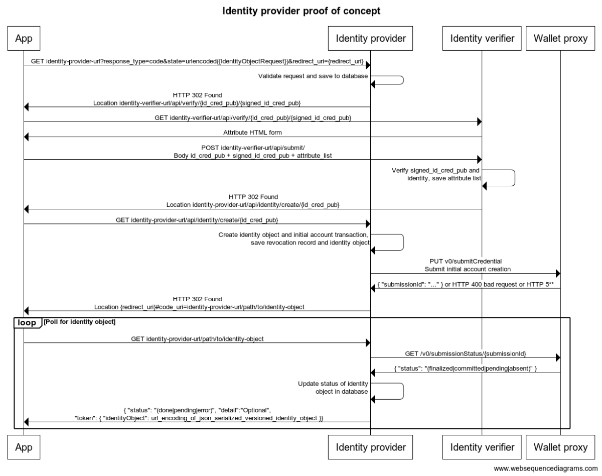

# Identity provider service

This module contains a proof of concept identity provider service which helps to show the flow that is required by
an identity provider. It uses the provided libraries from the crypto repository to verify the incoming request,
and after an identity verifier has verified the caller's identity, to create the identity object that the wallet can
then retrieve and use. 

# How to build and run

To build the executables move to the identity-provider-service directory and run:

```cargo build --release```

## Identity provider service

Navigate next to the generated binary and run (remember to update paths to your files):

```./identity-provider-service --identity-provider identity_provider.json --anonymity-revokers anonymity_revokers.json --global-context global.json```

Here identity_provider_file.json points to the file path for a file containing a JSON representation of the IpData type, and 
anonymity_revokers_file.json refers to a file containing the JSON representation of the ArsInfos type.

### Configuration file examples

An example of each file type can be found in the `data` directory of the module.

## Identity verifier service

Navigate next to the generated binary and run:

```./identity_verifier```

## Testing with the wallet on Staging

It is possible to test identity creation using the proof of concept identity provider service locally. Build and run the
two services as described above. Install and run an Android emulator using Android 8 (it is not possible
to use Android 9 or above, as they prohibit HTTP communication by default, which this proof of concept relies on). 
When creating a new identity select `Internal test` as this will forward the wallet to `10.0.2.2` which is how
the Android emulator calls the host machine.

## Exposed services

|Method|URL|Description|
|---|---|---|
|GET|`http://[hostname]:8100/api/identity?response_type=code&redirect_uri={redirect_uri}&state={idObjectRequest}`|The endpoint the wallet calls to initiate the identity creation flow.|
|GET|`http://[hostname]:8100/api/identity/{base_16_encoded_id_cred_pub}`|The endpoint that exposes access to created identity objects. The caller will be redirected to this URL after creation of an identity object, so that they can retrieve it.|
|POST|`http://[hostname]:8101/api/verify/`|An endpoint that simulates an identity verifier. The endpoint always returns OK 200 and provides a static attribute list independent of the caller.|

Here `[idObjectRequest]` should contain a URL encoded version of a JSON serialized versioned PreIdentityObject 
encapsulated with a idObjectRequest tag, i.e.: 
```
{
    "idObjectRequest" : 
    {
        "value": 
        {
            PreIdentityObject JSON...
        },
        "v": 0
    } 
}
```
encoded into a URL.

# Service flow description

The flow that is implemented by this proof of concept follows the flow that is expected by the current Concordium ID app 
for Android. The flow is as follows:

1. Receive a request from a wallet on `http://[hostname]:8100/api/identity?response_type=code&redirect_uri=concordiumwallet://identity-issuer/callback&state={idObjectRequest}`.
1. Deserialize `idObjectRequest` and validate its contents by using the supplied library function 
`id::identity_provider::validate_request`.
1. Perform identity verification with the identity verifier, i.e. the identity of the given caller has to be verified.
In the proof of concept the identity verifier is another service, which always verifies an identity and returns a 
static attribute list for any identity.
1. Create a signature for the received request and attribute list by using the supplied library function
`id::identity_provider::sign_identity_object`.
1. Save the corresponding revocation record that can be used by the anonymity revokers to identify the user.
1. Generate the identity object which consists of the received request, the attribute list and the signature and 
save it so that it can be retrieved later.
1. Return to the caller with an HTTP 302 Found redirect `location` header to where the identity object will be available
when processing has completed. In the case of the proof of concept it will be available instantaneously. The format of 
the `location` header is: `redirect_uri#code_uri=url_where_identity_object_can_be_retrieved`, where `redirect_uri` is
the query parameter received in step 1. The proof of concept supplies the identity object at `http://[hostname]:8100/api/identity/{id_cred_pub}`.
1. The wallet starts polling asynchronously for the identity object at the provided `code_uri`. When retrieving
 the identity object it is wrapped inside the following JSON object that the wallet expects:
```
{ 
    "status": "(done|pending|error)",
    "detail": "Optional free text",
    "token": { "identityObject": url_encoding_of_json_serialized_versioned_identity_object }
}
```
The `pending` status can be returned if the process of verifying and creating the identity is still processing. Done is used when
the identity object is available.

The flow above has also been pictured in the diagram below:



# Steps to manually test an identity provider service

The following steps can be taken to manually test an implementation of an identity provider. Note that the example
provided here is tied into the test data provided in the `data` directory, i.e. if you change the identity-provider,
then the following example won't be successful.

1. Act as a client that wants a new identity and send the following request:
    ```
    GET identity-provider-url?response_type=code&redirect_uri=concordiumwallet://identity-issuer/callback&state=%7B%0A%20%20%22idObjectRequest%22%3A%20%7B%0A%20%20%20%20%22value%22%3A%20%7B%0A%20%20%20%20%20%20%22idCredPub%22%3A%229748b3bdafcd9862d497902c9dd0134f8c527dd15ed6ac71ddd8ac06274ea09b97984148337dadd5a364be62827e92a8%22%2C%0A%20%20%20%20%20%20%22ipArData%22%3A%7B%0A%20%20%20%20%20%20%20%20%221%22%3A%7B%0A%20%20%20%20%20%20%20%20%20%20%22encPrfKeyShare%22%3A%228d302f77f5b60772bf67cdb94565c022788fb11f527dc0019533aeb2150e8c7c1b2eda3654b77e9370deb0adb0b4ac10b40cfc0888918a47a2a48ed0707bd33279e1b70df55d1cbce97900dc1935f4a8ec492b2696c02cfbedff487bf3efcdee97ec23011778b4f9f92fdbf8fd6aaaac943517cc5e271a8f7c789fef9eed99939049a58306ae95b1dfabf059dfe7b021b6591c1d1a40ed332b8ecd48d7c64157a8e0c2ab5acdb24384049b03e515399f7162dbc35ae01fc71925c010d6d50beaab3f55dbc1fd9803b922336bc479014140a5b4ccd218af7e2bde7520e69b0119a637560d0d19edf4f7a6be0d76128c29b51c12bf5a59772ae4fed69d67469741399a9996a5484f03da7eb2205d2a757f8abe83bcf0568f648ad0967ff792c1b7a399d9289b1fdb215b41dd6107a4340229c85c4aa748ea8850dfc2ff50090ba6fd0eef1c7739b10732b2a454709bb6cbacecd0679d131ad46d92794d551dc25b2fe4610bd875542b9e8e410e3e14fa44eb27e47b4658b0f38f016b3eb6f7a97490a311744aa63b37451fb7024bf1bcf25cf31498117ff29c13abc79a6c4a954996566bf71de07309c60859c95a3b55f98466d649d4ec3ea329df78ba06e2ba51c7957b47ac60f2bd80ed1b5ad02efc6f5893c3704c603b8f71779c52ee32320b8aada1cce41c3df76c1e199c4071031b1179e8e5f87a2577fe30252cfda8b421ed30aa01ac949f6cea1fe1c1bec335fda5b1656e73c5e1532b456546598617424ae195417992ed86daa0112e12c45febbd59d70fc4118a8afb11d2dfb8e341ef98454c31cf1d2de290de6221136ee1b385b34862de81decd90abb5369efeac996c4b6ff40c981ee999fcc2e76723094ab3f4df7582ec51be6fa62eb6e895146a525c292a5aa04aa64d0eb1c3497c5236fa112c829f3e68fad04caff23ab6b003a50b40ae363388de172872043d2e658a7f0a33364cc7214d70f0dca6f95686d18227172b8149f0bfc716d5d84aa190aa91f1fbf398514095e9d91e7bad8259721128283159bba8659d7f705ac715f34b4b89e6c32071a815d968da3435a0422a%22%2C%0A%20%20%20%20%20%20%20%20%20%20%22proofComEncEq%22%3A%2267d23e5a06462058bc3df2f5903430c157726e4646da6e20e7726133aea016df435317b64303ada63d7a8a7df776716466023b9ff53cb88ce1313debc300d82469214712d81b42959e333c5f1d6358574ad6747e9a9454d8d88633ba3023800e%22%0A%20%20%20%20%20%20%20%20%7D%2C%0A%20%20%20%20%20%20%20%20%222%22%3A%7B%0A%20%20%20%20%20%20%20%20%20%20%22encPrfKeyShare%22%3A%2285d8d675113ec5a04f85211757a7aa94196ccec2b40d9f75ea1d73bacc53e1b95d91fe2c641cd0a18bb855d5cd2130c892292984d77aeb3ae75ff8281002d0dc5b1aae908cf0ff37e984e74b72ec56b8fb734ff66bf306badb5430b207fc8fde897c21dcaf020ee17bd523c80d38cbbb6e350e7c7a4a10289e14ae4bf47e278b0a4767b650183caf2489a3b54f4bc9a2b8c88dc775a9da16c9f4c2823a0663b1f5241560257d87ee80f885e65b739a95d3d74c73b21b5534f847d7d66a587a9ca2d93b980f75b4f9409e3a51885e33b740e727dfa77949f688626ea173b41aa404223c95f79962ec258e17e090f031c9a6c0807a6105758a3b9cbe704ee3020384f76a5a836e0ceedb8251421a2efc06ce4dd35ac17222b823db5a0d40377eb8ad3d10e6b7c4babd0fc86334269dfbc48040f3e1e30a5a68c82f0bcb463fea8fa1c474f0919f06eb0f4085b5748a66ecb5ae1fddc7d9c8273a9fd45e3a11e8f48a5c1b37b4bd5242c381a9a9c9edd0cafc76610503b620b39ecbdceb2da41a15962808783097a18ac123ed2bd39d7b60782e86d27d4a4abe9bc5b746f592abaad4b3a38b46f1261ea4392611d2289ea2ace6fd55bd6ecd46c42192d55b5e81687baa9a46e3598a5ca4e18b1558342952eacdfc293c2bbdb51fcc6115fbac40e6b38e464bab483006f44c0506366feb436247aec12abc2a991d2405462a9a06de1a970c765282dc2b5f2d813b66367d21a1d6305ac4d0d316c539b7e4c0735f54db584aa87cb5236afd6f1adde66f6f92d92f1d17192b330204b81a54e16df929990fc7ba6cfeb857522297241a81419a884506d57760f68e9f685f7632a54e017a169d97368a5d64a2b5cacd5d397c07924ca399c812a0b8223928d36cd362af11e6643adc41d997d255273275f1e75fa9cba4789d6c061e3296864be28d8d2b8f5a0372808c5191aae805c4b2d4aa002d1c26b3695a0a92478ddc311127cd6dd23f8663de67f4f56c060e2b429a4903948247eec2c4fa3bcb7e9bf54ace175c5d46e27595a261b4d4d9992f05eb6229f1708543336f37ec773b7d5ec16823b6%22%2C%0A%20%20%20%20%20%20%20%20%20%20%22proofComEncEq%22%3A%2206d6f7451a9a9954a5f0f9fdaab17569d201b8a62b58032dc1269ab573c823821587c841abc1a53f8ea0d122af6785a329a1f7318bdd940e1dd1528262d6a95d0854e847beede9b56c64182dc0432066e1951f2276e4587be57b0a36440fc207%22%0A%20%20%20%20%20%20%20%20%7D%2C%0A%20%20%20%20%20%20%20%20%223%22%3A%7B%0A%20%20%20%20%20%20%20%20%20%20%22encPrfKeyShare%22%3A%22b9e97b909f0bca34d0523d77ae7d5b15f30cfdddeee9aa2aa9b06117614346ffd0eaf3b73d076a9cfaa4723c95fcab53b3fe561ed8bf6f8a9234a887aa4e7882707b486817194ad4317386da824ded29daee1bb5c39bdbf600390a9253cac6938960994591c110069843282f4471950df4daa79f661419f6c9e5e771111250218afba3feb50b24c2c09151ec7ad9479a8f2a2ee03ab4db4ecd322d45024a5622815cfeb64c77fdf7a18cc63deb552b857097901a05fa1a445a96092052b3bec8903e544cc02729a8c11a01c38475dc16f7a8a6f4bb6122a8e8d54ea638d3b76f28d7586f8413f5e5f1b248f2487e080ba1bf94ebd1082328045511953df81a03a06f0362a33c40e3a3a618a381ccfbca39dca1349ee90a226a45070e6367d5a4a78ce08003e3a74991bdfcbe9bedb8abd03e9a7b601bf97424d1034ed662595c5050c6e9245ea0fad8ab8ddd362657e4879e5888a5163c203404655d15b1f0dc9a736a1b6bb63ef07cd6f6a05eeb28e681763cb232827b9a5e9e74939144f288ad323adc9ea402cf9f5917223b45eb35ebb40df6dc046b01323f82cd0ba6100ce19b0508beceeaadb5e157f81b8598c3876563ee2b27401c2b4a04a4af620b950b7ca270abe26cd4260e98cf3163e525a9c2030f650d195325cf13ce23ca0f6c902556c666386030ffe1b3a22237d314e919fd19a6de2f0d2e7da48d73bc6418cd81fcd12d42d4f4c4c79c9570e632f8ad380cdceb311540bad5af033dcd9c822b36502b767e8eeee369a634b6151bfc30dc2c4008d344736777ccad6874a664851378020254bfeb9ef85aad7838d8a2722fd0a9205cae3ee58984faa33f5feb6a4aa4336d6a88a8e6509740c652d965a480aea9e23fcc307da3d0616ec0d82fad031599daf383d20af7f77b6010e31c52cdbdfda7129e6436799460048b7b38b30fb9a76482be873904e9b3ba7b854080e93a565e5d8289e9718c7bedd4336c22294eb0c533767b29850dd961fbbe40b7392f789bba9b2940dbd9bab576a158e42e35e74d6f6d6c4d9dff215f5bbf926c6c3bc7f908f8cf322df7d6ee218dcd%22%2C%0A%20%20%20%20%20%20%20%20%20%20%22proofComEncEq%22%3A%222bedb0b9b0c1cd8083fc95c543147a9cfc0a87b37cc64031083cfd8f1c69e9af413775e257eddd843ba52285c636cbbe62d892550f561d8479ec86cff82f1f1e410c47e731828107016e77625a54e86ff6102b80d526d85e880fc98c34fa8fc9%22%0A%20%20%20%20%20%20%20%20%7D%2C%0A%20%20%20%20%20%20%20%20%224%22%3A%7B%0A%20%20%20%20%20%20%20%20%20%20%22encPrfKeyShare%22%3A%2295eaea3df3a1f1320d5faefe0653238dcf13e867f390ba9264bb2ef4ae44c13913d4709791245779a1dec27931c05e2c939bacef3bb64072ddfd63ba60433e62292b7f6f01bb5b92c17bdd3c409b4494f5ccd0307a71ff4f2c3489056865a583a652ab1196c672fdc672d3e0e00dea36e8d36dbfeffb5a2914e6012bd93168e58b66167e92d41e074a88a79a8ed00526b71a997403b681ec3f0cf033207c77bd84b74f6e60c188c7a243d40a80a4ffb332cfff4a29260b6aa4640bafaae624aca3530c435cbb94c56988b4c6e3800d80bb31b9ce98a5faaa0fb6ad5463ec758aba953c18826e04313e77e3b686d6cb56b64804f653aa59917a44a0a63b7a7f91725e9d7a6552af39912c250ae40ec28d93e7642108f10357a97d292ffc9f41d8b6bb5e9dcd2f535f72f53f9d0e8e19793a55f2a4fbe22bb140037dfb95a749906533a4504e31eec81b45920e597a3015869b33598305bcfd202928bb2200fc42933d4476067ffa3a5bb260b539711bebff13caebb9069b3247d413ddd9a5c3a8b9e857fe4a1ee94bd6f78877f1ddfac5145d2cd2e5b915c51205c42759141e2a6eeefcf1c2928474fca1929cd2920b1d8078ad12ab03d8974bf519427010cbc710e837e354a8497b4a4a2528969ef063f382a2884c616e90d7843fd83c0cc973a8a1d69dd66e3c247c206bef8fda95a9850642833c13b6e5be775292f1195d99c828edc5afdee07eaf0178e1cde8bfc1b4493706565f7525284f702b7fa147ad1dd83442bcd719d66f390666d38096dbf113ca2127163ff5de14fff90e3198d2a4b9d7c10b993062c8fd74fc2529ea64cac23abe575b02e57c6ee6a5501ba326c414038501e576ab0e5327a18d93a546917a6983a260060a32bec9ce46548127699a0a1284fdcbecc3aa33951b2a4c5eb644385d36a02378117810aef1741512b1f4c8a7dd0559f53a20a70029e4e370820f058df72a14bda12b39e5feb0aa1ecd6e1d7c02f2bffcf184aa8f81e3656e8e4a5ce3afbeade6db2b7bf31f9d8f13501123b3c7bb3627cccf2492e4e815d1db14e5e1cd7f607f7d1d0588fbfc4862%22%2C%0A%20%20%20%20%20%20%20%20%20%20%22proofComEncEq%22%3A%222626afad080b6b62bb118197edd0b91db7be8662e255815fd45403f33de4a0803566f519a7ef1edf5d665206319f378115ee5ed4eea1c073904d211b3c8fda8c1e25c02c8294df8c02a4324e3e5b693de739040a9705063a622b1370ad06dcd2%22%0A%20%20%20%20%20%20%20%20%7D%0A%20%20%20%20%20%20%7D%2C%0A%20%20%20%20%20%20%22choiceArData%22%3A%7B%0A%20%20%20%20%20%20%20%20%22arIdentities%22%3A%5B%0A%20%20%20%20%20%20%20%20%20%201%2C%0A%20%20%20%20%20%20%20%20%20%202%2C%0A%20%20%20%20%20%20%20%20%20%203%2C%0A%20%20%20%20%20%20%20%20%20%204%0A%20%20%20%20%20%20%20%20%5D%2C%0A%20%20%20%20%20%20%20%20%22threshold%22%3A3%0A%20%20%20%20%20%20%7D%2C%0A%20%20%20%20%20%20%22idCredSecCommitment%22%3A%22b623c770c19637e0bc8b51bf68037e9cabdd5e7925a951e41ef99c7ecd12c0bdbe79ddb05cbc027f2eb3e4c4105f2a66%22%2C%0A%20%20%20%20%20%20%22prfKeyCommitmentWithIP%22%3A%22a13dee25fae860aadd2cd0df75a5853a3ce9ec7d98031fb9b0b7b2e756fc38b2641a521ee4fe084978d0a1e8c3301ccf%22%2C%0A%20%20%20%20%20%20%22prfKeySharingCoeffCommitments%22%3A%5B%0A%20%20%20%20%20%20%20%20%2288c57250f6caa80598363ef2cd13dfef3198d339edd426abfbdde58838730eb3b7bbbf52cf668ef4248e0ea8b2d776fc%22%2C%0A%20%20%20%20%20%20%20%20%22b537df6d97474658ef5e62fd6f0da23c731c7a260565dbc26a50b89b5ae443964ddb2504a25aa4977e0c7c82b879edc2%22%2C%0A%20%20%20%20%20%20%20%20%228afe9443e95733b815071c5ec8bbcbdea1045a633b365cd2f4091ffa91f70c31597e9f680a49c0c14191ddf5ef679dfb%22%0A%20%20%20%20%20%20%5D%2C%0A%20%20%20%20%20%20%22proofsOfKnowledge%22%3A%2267a088ebcd7c7ee3c0054bc51d18aa4dee8a4db3c28a1b4d2c31d8ad949370ad5d1cfe34c01432f98d09ede3966b9111789583084f45c58d0b66954fd6afd46845ef2ca2c191a6dc5564db429e14e006652e8007f7f059cd7430e52d4f0eef1a55bcbfb0cd08f0b369a089c039f55dfc57c0b995e6f37e163537471c71ab65f20385eccfd0b3dd13f8d4d66ccddc53569d71fd1efe33d11e910a8f792537681c159550c0879a8eb8ec3c933c9e57d8e37e39a7230b248953c2081ae97c74d4174a39c9e50017a7567baa2a98431c48f8d03f16ceadfff79029a54f02f8c3e4c900000000000000049463a2a5c31c45af2d5ddeb4e3f77f7887fa5baef37a34abdb3c86d4a855a27f3e4c7bd9d677d926a65d1ab816c3775c82059f9d8ba23b3bda370f02cd1f2482e8df3d77afd18a8d9e408e214f05fa4e5a33d8cf2ef360368f90cfda76c740d884778146866d993aaf386fb264f1ba461e7edd47d619b0d29aef445ccd7decefdfb9e64275d54070a622690e8304a161810c27ed924f2e201f7c3f2785b861edc38021c3c1202a7804a8069e765b9de6929e9b53b4328342f0eba49ea3d78c0f6aedf417e7a0fe76e5dd1a2c50b5cc75980fe024d81fa803bf0cd54edafa6a041032a61e24f66d78ae919dc62dcb11e289691a61b7eefe56a9caa3e4233269403a13c89b131c42c0be86e5e9dd17e573da25b532c4b05e38f39088ecbef007b60000000888f878f413a3eaac1c495b79dc56b20c3d3ea1d0cee4160a4dc047670a44e845d0885dcbe94713317340d3d015cd3c62b0606b9f9936f0bdd8368a664c2a313e6211ac60a4a1e1d6bd2319c2f7d34201af80959a760561b0051d2c06bbf413b3b7f07257283433b42706a660ef5872b49823ec26e9c6a839840329afa98d9192867d8e9801fc97194758f228e8d68876b2e988bf9ccbec937a9865dafc37fdac7a4820054ee25adff2d503d2d43528850fd4b8526c8b9a569f0b163723cdf559a4d0217d8291064ca174647434da58d85c9486f82195617f865605a5485c736c1deb7dc8bf8551c302f4db82cf73dc3888ea7099a4e9dc2232e3b036c9d18eb23a09493c4afa51f470f988601f796e4bc449437a214a79c9630bc801117f0569b5a6c68c66de13cf40fd188166f742f7668650ce52db04bad40f7265e1331619b21273e855b5cd956375e2ba2db17482a1cf9cc98ad5863264e85413462d6b620a26b4cfb05aaaf513c5823720ed3d5594a31d3531a4887478781724494655d6b930e5f12639d8feeb49fc4315c4e26458426c263d4d6c43c4ee9f5105458b10a3c7b4873acb9047a1c0b199d90bdeefb4a255d41533aa885a7af66d726a02667f74cb401ceace54bf1432a685650b7d6b42d098d1ed3fbaf4b89dcf871a484197cd1c32fef055ffafb80f07166007e6584ae295bc281fbaa04e72343bc23f5e29e9a219ce990f7c0d05323fe4fe101d89340afe3323b1143a724d56e97b1f661461decfdbece99ad9c59b8298a0e55c51890e1057474b91a0568984c8e9dc65851b4fd25166c65d6e2e94f7a9a667d7b904c01e7835c8fb119c1b27277ac663a9df8f7e6540d8aa302dd2ad5b5483f7ab338932c6d1a89ba5376be9f6cbb1953b43d033b532203079ba29c213e1cd1ce80aa760f1ac599ee33665091971783193b1707dc62ac26ce1161389f3d5d8413678dfe4714237f66baab573d8d16e431069a647e760497566228cac3f4fb49f84b395d3ad728e6022ab680661dac6477c5d96d72655b4820fb26d2a180f1bbd27812acb6bbca654795ebb6e6afee8bc2a37bbdd6edc0a119ad5982036b4c165ecea6d086fde0b8d83be092b1c53aaa438bbf1a64a9ede26633fb47ca1df22ae4fa0dd6af2a4e61ca87846bc4a81dd9491f3e02af9d45aceb5b17227d244d1255673d281191e206b3bf5afd65df7769b9fad8f3a80b7edc4a07d0473be385b6695b8eb9d2cb90e4b785bcdba3d9fcca128d2ff75db63bafe6b547165dc4e1daa9900aef7d9bf65fc83220f29842ef1ea987c9953791634b9131c537edca2c528f58f5a7dfbf9415f8b233d4fc54a1fb5b67dbc8c447245fd487f2287ce0a2e069472a6fc8be6a4bcfdd331d118dc950e18cbab09a6443b024dd710adfd9396644c3b1d959581548dfa6ed1b8f53f7bc05b64e2ecc342cec472babe6ad63745e6e03c41a3358fe9a4796742f937335b96492753f618aba0d49074b1781f59d9cb417d2ec7f47ec6adf0f5efe92e1d9acf0bad32d34b3c7582ee5f13c6741ea6cc0a3b6abae4f067a499af7dc830610bd200000008a4caed5269ae5ac306cf2b125e42c9597b2d877d36944f8220e15edf240aed938195ff330a70f8eafa28caead866315aa18ad6f8d59f640101549e4287c0a764c3ab5ea35b7b23df32d3fb279a91ac576a0d0294e640189e9038e8c7d1c36a65b0e8ca450e42e28b88e4c8e5090fdd83809fd81415e83cc78bd0e1dda8958c75a3cd3583e9ea2fe1618b0e4483f6f4a5a65ed61b896c5ffd90e6a51fe9adbc7822eaf3595975645640349a0464d68068817d29dea4135d66edbc626b4ae7f7f8b66e96664f62e8421682c778eceb50802aeb1d7a7dac3904491c055aaf2dde891a056c5cc116c2fc6ec94cbdcb80ff328d049881db7a8c8fc5738cb74c184b0f4c0cef207e8ea87a3fe47122593e1fe89f9a7d42f132322e4f42a9cfb88d542991ab98e89caa8c3b8ac5b213cc261a070bc5d3b73aa02df48bd74a68d53dc55e88e7821c712065c6040714dc57f522c9a0cda7239fc9fd659c418751f47c6bf6ae8b7aff4d2d3d44a6463df394b7348899b8638f5675f91ef81c95901a58f6d7826640fbbca0c529a2799e827d250c7ba84719ced68f96a30d0ad324103819b66df427d6ed857f6398c97d8a15ac0309b544bb85d1a30c20d594fa714f2544e383db26087af33d344b41f7a6c365a39899e9a4befcdb4b839692a4c4467d9fad942e70745c10b6d1e0786f8dc17b9d1b4d64edabb75660ea53218c5cfefcd30f0adeab6668fbd5a0b2e63240d9ab9a0bb7c05bf2d954d0ebb3bab016695a9a59d94d23dcd9e744d2628656442ce1c193cec47aa172a5b3f29ed0f54bb79c0cf3958eaa558619a3984010aa0de01db83e0accfd83cf97ab26ba1a7227417324a6eba83a973589bd54bc0775d0a136c636b707db060d4cdf1704330ce314226ac2f2282754d434232ad9e7b3cdd51020d8d546b013fcd432f87a471584640ed39f995c28ba18617f0d25997213e3bd17166669371f2ecd8f1a533c4ccf68a65eee7d0f21384b1aa8aee9c77dbaa29585c4ab76d9d054f623bbec0269d1d8d8ad3d5d5534586466f70d6105c82ccb7be524c507ce4c93ce1d39a4dcc00dad9de6424036f225ceb90dc259b15f839c5aa32c088a25dc9fd4cbe205bc968488422ef2153f1f6f29bec6e59a9d68ce5532bb01f4ab12b62e94dc3f762e5b87e0bb8b9ca4373b5cd3eadcf64ed1894461e28c9529320fcdea14e1fb142e0cd9a48dfc3de9bd5883e6e8d38afc29cee792d455b4ad2bec87d1fa9904446954de255409fff8fca626b483193ee6f38982819c70e99f5c34d7156ff495c05d51a90147a2ed8b886e25f43e26fcc8b5b8a4685c09613aaed7a4b8d0b6fea58b9eefcf61388ff2ee1dd0ec8cb271c9d8a3cc1342728e906e5f1b3fae0a0aa966dffc1dc253a18d82a9ae4fe06ea2b851626476ad9010f773c51640fcd896ef96ec8688e967f16da39e6649c84f461041d21b231697006b021bbd144ed77bf69a06a04397265f217648076d63057888d92e56dcb4f8d73f015698372123d83b47b95d29a2f8c247ca6cd5b7dec88ae4f4c305087955d000c5ac7dab643af7f589a5f17aaf5401000000088d1536bb7a9371138c2000db5976aba14822a47116b5e2b03fd6b392655d15b20ba45a7e878f1ac5749323c2f176a9338205fc4cca32a49da4932423c45d419e6d5f3ce9b14435c5f6f5d349da38cca8bb9ffc00c455da0ecd36568bca3b7ff0919bd2c372027f2e66df480b5b66349ea42df4d1839d8a70fe73a879d5951079e25bc0ddc42c44abe96912f802c3e202ae6146f4882028ae2d5d5d25d21930909412c605f293bd058ae877846dec2584faa0c3b04dd9ea543543c80e04c36d13afd688204f7be2a6d1c9acd24a999e231f83b69459ec453b92ac315a21158ce7ddda646a4e2186ad9acaa5071335e0cf8c3879d7e62f994ba45d75aa83fe880b2d768aa1e64f97c47052f29af91b0bd448340a122ab8c3d5f3cf933a3fbea7818d755ea878bf1402a8cca30402a401ee7fbd7599aacc08f13fc13a416d4e28583ae9a8c8c536943a538cf75d1ebd4d56a5b827f70fc9e92888808a4d6c99276d2018bf75e1a362c7d066c92a8b4575d8b14b74a5ea67364e9005fd7f713e4d9fb3197b909ec83970c5e2d67787f5c7978f4f81b7b1fe6a1cf9ad399163310fae186d10e60e0489e7bc0e1d046720916f82ebba59f0e0ac4fd358b390f80f927d4c7e402822c77de74c0a4af5bd7e87ca7a908ccebfa6cfb03f39a75e9b11e359b68ce704870026998fa4d191bc4e42d760d47af4c37a177b57c3468e1133f65f34a884ecaf1eee8e9c4399a4752f24ff88e6653f11d81bfb9c27f3fb732175f68ed8ed1f358da949975ce9fb1376cad958c11244ef12f4775f9156ac682a2b3d8e236890e860aa07b6d8878b77e64981dddc45244efb8604b0933f900f19f1694eb2bf552c5b0837eba38fb70368f1c4a246a4d4f9a4c3bb781aafcff31d1d46d09b5db79269946a54d41d8027ba0fdb54fcc243c911e6e51fa64813e80ac237aabb802308a035fe57afd8521a8943a9ea5060413761d90e5aa566c87cd5395b94d3c53c02c8c3045b371221cf0715319641ea18f714b78b57d41b0c5b524b68c99fcbe5ab6cdab030ea9c7129a1a7ea8ff466a6e137d1a6d529ae14fa396d2c1bc8e91e6a30add65696535f0eb1cbdf01b33b0de4c58db49bc279370fcd8f5c4581b51aa53faf92a5bc430d780fe88c9f29d1d12f9efbbb1f9ecc72f789a81cb2f84ceb10fa7df6a00c1427af9a1c1022cc9381f0934d0c20c3d8e54e6a3baf55e90db1c53b546677252debf1aa89fa8034919b783b24ce3f44235e0df25ae070480e30b180c6e67f27dcee8adbf6069a6d025c2ae20fcd6a4af6a42cfc1b0cb704db8939a9eaf75dcd345e9dbad40402038d97b2ae5421c01e59dfe80dddd2ccb930499ff96bed3c2180c3c60cda80a310535efcf42d16d008b33a6df94395d2580f0f382c1dd4b09df2333d92cd08f54ee00abe8e39d5fffdec3afda28e3c4be9a3c770e095520b646a27ba28471d23399f923e80ff8a6153e6181cb29072268b250c0b3399febf4f25d30d492cf3c05a86983bd3afe2c6bcae9d995d381843375b75120e602ee91df861814c42691196312fc5d6a4977c3e15edf1b4eaad0000000890900c465c5e8020e1e66c350142fe99cecdd4ec38b63c86b1de97f9eadcac09b0439631f269ed0ec8ee05de08ebeb5bae57201a2e47d3bdd95649d6857944cffca4f82eb188e3e257ea50b1cf86df7b140861e7282ee61a0d0aa731975fa8378b59a9dbbd0df73a2d1ec5c4a4a822379ebb183874e9fc1e9c8d9dd9d31639fa525d07115c2501f535bec77ed410aee68070302b03f0827cfd85de79e6dddfe6fd58c8df1909d21ef5ee3d3bbdbee0a8c964a1aabdeeffb45e21efc0a205a8dbb12b8ae959f8d66bcff1fc4988fdd2e68cf2cf2fb399c11bbcc414188555dfefe54942835325a9482b8fa36e6cbffc97b3025f50a5c359db76a080383eed1e26138894293459ce6dbaa2ac02c6558cb049fa8e38d3cc5fa73f3528c9cfc80b4d8b1edf1dfaa2904f323807174dd9c2a2e0f6f0bf47f136d696cd1c2af2b2bce72bdeb1af5d49d321d85991dc7348f51fa016b8c3010dcf0a1042a3b290312a6890c6467245244e96e2012149a01fa5e04f1d4b6e028a40d3692a9ffbb87df800aff8a476938b7602025562cd1a1ca7fd4518f6ddfc68a341cfe0468edbbfbd2612db254586505641758427da915e5322b7e967e164b040d2d34f0802f7656f975b56eac2b87e41f39181386ef5f4247892898ec1999747c9646843f28d0f4c99a9af66fbdf460f7dacf395861d821ddfc99f0426958c67b9ed80644e568da9e7c22053fe06b754bc427d83068cabcac7b016cbbea1ed8f0f7cd01b1694391d89a4407d7d67887120373f3eafb4a0b31cc52dd5c00b2ae3f9aa0b58b8fe6098b69313ce83fea01aacdd1830414957c0a3b42de139bc07e5fd352ee97c6f86c88d96d557d19bc7070bd01fb288e5ebb6bbb78d5e304ec14c8de551e06a3624f3bd935fec7a2324e357e3e73a86dc8ec155a9f0f8b2e76a67450b511f3c79d46e5bb264420fb5e9e0b0b801ad5823d7403e6eaf5bea38f5de761b7a663337e1bf149c696bf91fdac9cf679ef99e370de2e9ab05b6877e2ed772546c454e865b26936da59f0b138696e54de261c06a2a0f8e47dd8fba31d5dcd03a13a4234453c5d529474e17ab6981e999f25e496d7cca6d166b53f6b36542d3dd53e0f6b4fba41838062f14eeda47e38530c5af5dd9cc73f309085466afc0d95ff15a3f3eecd74d%22%0A%20%20%20%20%7D%2C%0A%20%20%20%20%22v%22%3A%200%0A%20%20%7D%0A%7D
    ```
1. If the identity provider returned successfully, then verify that the HTTP code is 302 Found, and that the `location` 
header is `concordiumwallet://identity-issuer/callback#code_uri=url_where_identity_object_is_available`. The first part 
is  determined by the value of `redirect_uri`, but the value for `code_uri` is controlled by the identity provider 
implementation, and should direct to the service that serves the identity object when it has been created.
1. Verify that the anonymity revocation record and the identity object have been stored if the identity verification
process has completed.
1. Test that the identity object can be retrieved by sending the following request:
    ```
    GET url_where_identity_object_is_available
    ```
1. An example of a successful response is HTTP 200 with the following bodies depending on the scenario:

    ```
    {
        "status": "done",
        "token": "%7B+%22identityObject%22%3A+%7B%22v%22%3A0%2C%22value%22%3A%7B%22preIdentityObject%22%3A%7B%22idCredPub%22%3A%22a712eb3dba39a923e5df7a72083e4eb5fc6c10ea3d635d8e893b5e5d0812a9c4f03e9bba23e4ef62e25bc3d0c589848b%22%2C%22ipArData%22%3A%7B%221%22%3A%7B%22encPrfKeyShare%22%3A%2290c68600205f4a01a23faa64342bd17ec855cf743909dcbe36fa1a7be3c4bb8903d15d85b366b3c1e289ea66c724f4d8a10e0222904bfdadd9f463d06c1eeba0eb9102eea875a423dbda298518497312aa2552f4d523c12a2bb21dbb57f7348da50392da85359295d5238d59a188789fa537c19ab88b820c9f95410008827f34f5f2a2fc42fb02c76f4ff98bedea46a985a072c850b6f7810e75b95dde1f0b320bd421d3371a9afb1b60d2ce0dc0af262e38e26efbe2d0e4029c7a4c0ecd0e92992b87257e33da617865b83dde7cc47676e3606c926c60179c7655f091f463eb22eed2911c44bcf635a315d94314ae15876b31eda67d8205141b064faba319929f773654d9304e5ececd96c6fe43ac726c362684982baf4ebd968a2c979dafd3b6492e878730abbea93a688bdb98d0e9b02795eb5b2727b9d17a81c4b18209c8c20560c40c035d7e86213f69c4483956969250face215aca71120f815e472a453d16f9bfc48636f887fe71c69509b3170141dff237928777d8e213561aae5bcd972bdb76434d205af943caba756a732af1e1efb5e892e4c937be707d2b74b63586418f6e63684eee77f823222797e0be862fe31983bfc5904ade3a62800f518afa27df2f7cb9758a1e8db7c2a991755ef2afd96e145358e596cbb68f5884cc15a7bcbb53fca4b67f089ae2dd8aea783adc265782e824340cc678540e126e47849b9fdb2021ba8a098a06206e9bbd353193d6570fb8f5893181c06c30a79fb4f25d0fed5014a3a8a131fa3dec3eece1b7196c51685a73669f64338a5329c1b0ec90889d52b179984ff8f35436e07b8960aec782fcc5628b8108b8fff459372c8b1e6bd15dfdc82d74a2f087b51c5939cb8cec93c6baed698bae1dab82ff5b8a20215aa387c338e233061ffb67256aa1c9781faf69d692999e84a0ef54029c2915a78005f7936eb484363561a01f25acb5f58e7ca60001886c7c63a7d91a99993876366d812b5b54d4b51b535c19c843a4b52a19503886bc1dff2d39645075cce7bb3d591d511c0b226ff4672338d71393ac96dfcc66627d057185ea37d406a776%22%2C%22proofComEncEq%22%3A%2215f6d7e6ce0f90baa1ea3e7e0e6f46aa07bae671e971f8c0fe811b3a600344ab5b5cae6fe3aad05be549892cd6204a94f2ec765a1b2041730c539cb05c6e2076239cc5320ef5ca55b745bcceacc682d243b8dd9a1faccf2eb7029a303df83cc5%22%7D%2C%222%22%3A%7B%22encPrfKeyShare%22%3A%22b1e44ff2650cb3b5f0f99bb7617b3475102b111473b552c73df585c942b97d30ec62f9a8fe9a9e172e8efe06b5dd4d8c8938381796849ab83d6d83ec2db6f0d310f126ba1ad522cca786d09d67d5917ccf64b164a0305e6e4673e07c60a8b0aeb47bcd966a70ec5471da03416d248d9ad2890ca031a255b00d9a7ff9168dc8a8dd2d53fe5444fdb2f04c2dc1298fc43bb0ad9d86b5de2728b9e8b5f3e8ac130de86f78b188d170c5c06ba890b842a36b93cd3399779eb0d9e5827c518d6957d4ac5b234d77c681a3046cbe87a09f49b60352fddc3a611c0c677a300d224e57477a1b7dd811c2fe2a03b042eb8ccb84aa91d1e1b6a8546defc9c84544c5f524fc3b9109b80c85c59a291c24b1e8f4f99fd35428b96cfa7efd8c89fb97885d33ad8418c1849644999631cc6eb32ca56934d64905dc80cbe49be617cb2cb89b0d3b1a1202883cc350269e03c14fc11a65aba86c89be625a1a09d2740368938713c4ffcf0a15df3cf32bdafe8c93f952c08858f042ff1857b1c2078172df56f46dbea070cc2edfa61779749b33a462c05fe5b300f4cc24445721c4dd49405d72c72db10b4f94e7c8b99be48394216558843d813d2a399800545d851344b4cad93c10d14e4336011b77bb4e64fa6293370d709deb4b9db41d112c9182c165428e3949a23cc3b1b5632cd7c0a48ec0f0c5c0e4deb0d62649ffdd49b779724997ab80301d8697cc2d6e33954a67d77536bc454088f77e47e130be4a770650429d3bc8ab214338bfd58da3e8e930d2b4438924f5236325dcb86175002aeddae97160eca5a672f885b2f12c553893cce00dbf816a0a42c14f3b22f9b84cce450ed58be9674c1e039bd03039a97af5cfb57ea2e9f686ea0e1860e3ed6997af4dfdfc26a1add4e14721c4c1a4c08e97873579046d95540f750efad2a0e3877fbe995b3191edad83a23e6be357f071c8c7361f7dbd6f08ca238234882ccef18cf26e8bca4be4bb8c7728bf0ab8e98a42ed968f3a33b9a9bd335d0c079ab79097f123ccebf75fd3dad44e3aaa66ca8fe2e65743d7913c201c44a995ab6d820ad551d0569fb2d4%22%2C%22proofComEncEq%22%3A%22539c8b81032d94ad60d18d7af1e22430ddfc45b82a855d9d020379cd6d6b86056d29a1993919a15bb03a268fc932f4df7ca9b5afbc9f1fc46d4ed7946176cfd643ff603fa579f8cd3832065ab4ece413cf9a771f2f5975fcd218974cacbace98%22%7D%2C%223%22%3A%7B%22encPrfKeyShare%22%3A%22a99c1708a7aac68d2d9057edd24c1bf3d1c43753b82cb61b9062972367504ab6a13a3873a65f5568a0bc4da3dc7c35efacfac08da7502846c5b09aefc9f91cc3b8235d495248aa5e839bb85142a3d889cc8540f9b37cef1ea02eb3e42dbe2ff89498929dc2fbcf519c1fb4d7fd77a37f5eba50f6825dd260d0eb5511fe2d0db3e085c9d31e751047017cacde588cdea6ab1987d7ff797966121d10d80a2d9f2e637688113b7c6974d9ff650cd56efd60421aeea4a8473d0e88820ada995a12f088e90c878c9a686d9f751d404672a51c42faeee31a6ab89650fc3d4f952c74a2dea36411d07555bc5a7db0dc34a05e83ac75a9a30948defb82145a7ee9c89f3201acc1961ab3066c8d98a210592f05325f688c0975f64c4e265d155d776461bab5b3dbadc8f12633bee6513c0ae74a2fe08bca44baa1d0aa500827b41ebbfa43af504766326f149f822130e8c286056685a44f9d5231c6eb0ef9ca3a92e471dd28237c7de2dfdc38b2cb2eeadd5eb470dd8d009660ba651eb0716371e75fd0a6b1502030c52a3d7fc776d035fc5360654732251cf2cba6115f357ab414e5fe5f641f48612e12ee810f807358119c49ceb310732e64edbf86950485ab3c52fb6ee30e1360a37fb819f4a6c7881fe58a8ab6e0012b66d85004ae4ce75af877480ab39f118e686b77f5b830e6d5ce6d3e6bb64bec971b80cbf8437fb50edaaccb4f2a08d2d011259a6a20550e2c3fcab927b7c0308ac6805154cf65d1f3ab075016c4ce1ac0d67deb38b175a1431e656310f8213ccd0000eb6ab8a901059bc4bc1281968fd82170c2ce7c1a0c94df281205fe8352169e47629299dfd1ad1d506e0823acda8b2884552075e66bf1dedd45e28f0d9fafb224e6e013d40506baddc789b0acdcdd6a722d24bafa833231a83f9909e516d18ddf21c994eea3fb6fa104ee80438e59fbdca15052fee8616199ef5ecaff100c7bda926f781f04f6ff7055fe65cb002af023b36446d068a4644b1f9e820484152a2e38d1f69a92f9c120a443e9c35bf0f9e5a6ddb30aadcb3cf3bc5c87f49bf9d06e776ddfe35f9905bb0861%22%2C%22proofComEncEq%22%3A%2200b5095f55d98aeb84e52017bd5764950126b4690139e021b5109e0c6ed21d3b3c9a27adac42a66b79280c493a9fedcc1f767e1fad40c9698dddd99b542514794cbf559a330c4eebeb36e3c0b4b7fa10302b9d59e440cbe73b12656b0f6c9d42%22%7D%7D%2C%22choiceArData%22%3A%7B%22arIdentities%22%3A%5B1%2C2%2C3%5D%2C%22threshold%22%3A2%7D%2C%22idCredSecCommitment%22%3A%22853d937f9d1d3cb1864058123d1956b9ddc597a07d385fd05016c57829077a9c9ed4cd78748f9ed3ea492f029d8e3da1%22%2C%22prfKeyCommitmentWithIP%22%3A%2291f7091edcb6d5dd4849e81b60a65a0efe37f18db62f770a4e49de1695ef723bc532792101fea0343c3a7a08b419b14d%22%2C%22prfKeySharingCoeffCommitments%22%3A%5B%22897c11a602a30d9e8189baa8c64dce4bbb2eff9569021c3c684234e06cd7929869ca296f514b19823ab315f1ce294899%22%2C%22b15a2c7539c8e168db142084080dfbc9e0a8838d7fc8a656af982104cc912562f1b71d0c5a8c23b8e71b4b899e37e9e5%22%5D%2C%22proofsOfKnowledge%22%3A%22c6dc181f31484120b513f79edbd6d99b47e90ad322a8c3580158ca35d05a2f301e0df04e200773359460694cfe3e0b461794f876177bd4f165a6c20e1d7202730d9a92306f8ee9bbae646fbe76baff45ff717fe2e048c95d934b84bb42f4813e1e736c6020c39e9721eb2ce0b6de637cee11c4a8e12e170bfc2abba77f7f052b696f93c5b377dff56382e339f246e7497cd7eae73089a8c7248926e41ebbcf324c0d07ff75df22ac3bab3e3cef3f932c634347af0ea00ce3f2ecc10bc4aa3c510a893c6f022e5326db6cbccb3c0d099cc2f732dee8a2101f10a986f02d94fd2c0000000000000003919faa3f547c5303bd1f15173599274ea05d23a5964154802b6d8e0d8a486649b1dc44be6f832b0b39669e71e20004b5aa7fb974ce43d472524f2b2ae06e52daf2b2232c2aac386798b3af41e7ab273e3f2758bb03f4e4b071996deb28a0c32ea254138b054e33705b1b8c65a62358c594ed0aab8a794f259cefa15b26236ee3e28191b63d23e41c0a773f61414107bd88c5af0ed645e88249eaa745d1cc6fbff14998ff807b3a0c99eded3a27bb56d1265ce8371d3ee96e978a4f2afec78c60029faf1f4f5e93f413bef04bd9854918305b587bb559604bf4614f539aed93784ab146281724af36b82b1162556100b0f25b08943f6080b10741f5240d6e3a313e4fcc472975519b0b24e519f3f9493554693a9a36c3e9311a4a5f6699afbaa800000008b7e449b93c62de0c638b5a2f27fdfe7db3dd51444c9209d47c46e2686ebf0a1fad1135619159c60c2be249c23fba595ba526525c4760b155c40669d04c894b4722941c20b0c3f5288b38222cacfc86b25d207ae48d97d00d16fea5e605cbf25ab7f132e3c441b2b3f4b1f8baef7e46628dfb08d7e2bef3652339c3d29e2bc66cd67f5099e23635e40873d3c40bae20778f41a0efa45e9c0cb0f32d13066ffbd56066911af737724f3035a5146c161288451ca42bfe5ffc1203d25d3cf872575393c96c5cd196b62aa617a59b48bd77a0ea3205312543f30bb4cb3c60f414037e961e0fba583d8a4a847bead132096193a6070a94558887b6a53d8e279eb23f46f7bf5a6e36f28fa28689f9efbd29847707010e63da05889b2f946b4a17ed39c08dc8f9467eb06c37616f5f00a9e8561731f37860f834113fb5e99ef8b7222d18b2f10c54ddd6ba2d415f8a01c23a8f62a9a58581909c51cfe094557685f7889574c3a5d4f870b7b6c2255fbd34c80d1d33c5f78190af9d1acc2602617b5f48a9a8a77fba454dcb425a2a4e674193c5611d31165cc7552f50213856763e5afa86c7c740e55e6243b24cde25c4ffd9601ba5ea6c872dc986034b94616116a699d16fc2c6c27e5af176bdc521f9dbba4480b5c7f2d2bc8af98781eaa7b2092d291a8eb891e0823b48f4d7e35a6c7c14c3027b4fef8a6b99fc27e96b2eee58ef4e9488b98206f23a2cb74ac933caf886e5a3b67b323fe73074c116cfef1f4aaddd87f1a03c91e3b8b9b7260578765ec651a14d75229039c108b545aa395fe57ca0e7a2e3b7eefc5bf83023015cfabd3e02c91c80a4e987f50cfa1c7bd8c7672da8200a4d6d9454cf42676ebb6da22b9ceaeeb011818e0c070cdddc411612eb7916d6d4baeeb9f167c42f500e0e4d9d764e89ab747068efefb2e2b59b78b3fe3c738bb0b1d5cdb379e4fc4ce891eb5d11e65e4566c6fcca7e18e0cdfceafeb7d75574faa2d597dd3547400d393c14f048dfae9877d6b6223f49cb74c135323a8fdc6ac1684f0d2395d40a7da5eddb91aa4a193c3633e64c0c57e8fec911f0e393b33c2c2d4090f51d62bd036ecbdae6560f48deac9baf0f27eccd4ca8a8901c94a2dc47df056b7f70d863a0fda1bdfd1120add45bb02a3aef8b9421f2ad98c47fe549a25ecf700e1943cfa92d80d75af4548b91fc88f69c5c8b81da0d7b55de6bc4222043395a154aac16faf5a268805094f386e2dd39c52619215bea0c4d9e2e6f97c07e165a747351a5190dd0623cc34d92b5598464e3797bd7a73797515a2bcc73a0ee4f5fccc42d0076a9bb47482e563f36022438283b7e8b5d68e3f25e319511b4e97c84621c575e5a0edb6146cead68aec2ba79e30ff2e121923bbfcc734db905c33d3de3a75562414acc34ce2c0ea37315aa2e5d66ac4acbcdf633489af6ad7136296313361439c9dad51d9508fb2e9a01d01dd2c4e717685d45f6cbd3f1e00dbbb85545f07e71195798eb605d96c8aa0f940512eb36a21db5464de6aad650041aa01434a29ada21a1e623fbddf909b0929a074fd0ae3a414ed1a44bec9a06000000088b0306efbd3532d235fe9357e2362fcbfd5d8ec417992f655b08baaff23d943aaa8a12faa4f3dc67d67fe33b5201d7ea8922f31c34210c6d9973158011c158566611c2a7044b2ed70dfa517770d83e5167cbe0cf019557d59b2a93b5e00cd6b98d692c871c47129a28c06e0105ce6aafe5374c8b2c8e8067076e8fb89f6b61d0bef9a98025a9472f3a7ac43c1fa0902d83f75bbf701de1e4e0b51cc289c3d76e3393e9f0d90e7217758ec411cd63dbebec41ee845c4331239a9f25e72e13083ca4776d81ab8427f746c6d7a7b4af37fc0be4c30ea3c344b7776a1f669220a85e41b2f1869bcbb77010ac3d914fa18a11ae8350736faad2a4c7308d06d5a318d56c7d3b730af096050b907eb62bcad17efdafd808d5c9fdd0ebc60a2283a19ace931f9e946092b029a8f57a5700c55abbf0c6e70685625ec3268e3fbf7190859e872846daa945fcb8f39a1a28be7a0d9caf0c151dfb658ba3386e54499f6e0136a12b6d9ac8ecde6a4cde79facddf30469c69d1d6a21938d30c4982cd95dbdf638105f20d01c1b660025b79b199d16b75ec93f05677a4a8d111b0da5ef2d1c981ddfaa37202f6ddb4734933ced83fbb68877905e983e3ca7c1526217ef47daa45b65f7c14b4a69d56622f24942c814cfe528d2865c6430f007cabff76a0f7735599cc3ed025c3bc698ad82ad4146fb79217ef929b133699f471e9345b90f5028ed957ff83b9d512335f7dbb5a61209c6f8b15f3d69ae972c4aa83cb8edd1b89de4e150de534218fab2c2b59627284034bfd5941498583ca6fdcb913e49f077eaeaa74e7bcc2f11957622bb28aab08fe7033fe88354e47543646285c76c66afd482feb94187e183d9c4325a4944b143af08c4314614327583afe868f03821507d8b2faec4d21fb95ce0a0a5efc5c98a3d801c167e7f8b6c25668a5f931134cd51f9729e29162df6de0775866f5881b9caf30b81d5dd2ba5645960a8db616d2b7618fe1486959462e999d604a9146ce7d36b74a065386fdf09c7900c3a21ab489ea47050c30df5e556607aa06cd709fef95b465f4c5dff70aee53fce0c1f7421ed1087ce029b99c551b886d1bc01a134a9f3cbc2afe0c9e5a86587037149634285f1a9a354adbf84a9ea24a5ea2f04ff1df1f039bdfc9ca6c78b7f7cc4bff2aa489b23719692eb29b48bde8f3d231eb96b7566753097fe8644b0dd4c3b2be84bca21cbf2e58338698e0456435eb19c1dc4a805b64d6c83676edca55d638fca7531f20d7ed88322b5723075289cc90dc85f5ccb407a7d40a9c52e66ee10966d2f32ea752eb2e31b4efd41d994a7682f35d8e9488abae10bf89bcb29a31b71459d616b9d40c5e836ad9e976995d82ebbef5d8b15cafb64dc84440fce67fb1d6a726ad541794f026fc9b038b7b3dfff1924fc1299362b72ecc4fbe1649e36a17d122ea1b4f86e00273d3f5ef6df3e00a895579adc7229007c6478dc733ceffff4bed191a1d0d92f5ecbd8a66e3de459ede3f47a635734af325d7d079dac5404a7756d6530c784e0bd749e95d97aa65ce0e9932cd79d8686e6dc024b13828e0120909ee000000089484123e7ff90668eaf765dc2fcd16b21e83297e71d0f399ec821155cf88830dd89d60a6127f9d58285ba598be6b97629587ca755b115e7aa37ae31c46dfb93021541ddcff6c18624791925c6903b0383e8d1c1a7289bbf6de85f7257b51cdfba712d30a42b3af22b8c60daa3a324383e6d2bd86be87398f6f83f22b0cb71c03e872434dd859d8c5cd152fcfb4f496308b0e5238da109493a955fd8c24a76ab4b9ff4ead9965741a07e6ea8fd63ade443b5879ea6e9a9a3354863755647bc80a80a9f74447b0759160f3de7adb4f2b8fdab95db45036061266f7121f4175d0302608e206fa0f1960b93f059d0ffc20c88ec965a7e942b8fe97093617d3c0219428c926d195b932567bdd2bfce40b248b10f3d76106ac9a298f63c52541d571118e615a43834d73983d509bc717d80d136d6425c911f74526038787670b77d696f2a676642d14dbf6aec247898a880dfea9b13dd4f55056ee8656a61f7d042514b62b997a0d7a0e21c8b09c1726e007c0b34ceb9fdc3ec421b0b6edcf79b2e19c851f1a9a108647a91636cfdbbcedb71c26cf6aa750f7effbf659f92cc775e52d7e44ae9db363fee71385730a73903d05a6ff624bd245efc1c4d0ccf7f1efd414c83eb76a0f8c39e78ae0ee5ff8e6287e0b728827eeaaab3c23dfa524cbd040dca17451d108827c66657f568d03bd0c5d1a9c4dbe54148da239cad436f3d28e374dbe266783587fe0d699087da745d19bb4d11097b7fddb18e4c86a3911bbf6acb8278f077bdd26098926f8bc32984f9d2e1fe336c9c17754f8c658caf315976ba2c2c300e99954811b2bcfac99a342971369b4b5aaf3dbd9f88c486de1e39fcd7858a38c6a2dcc18da3bcf0e7aed28e0ad7f13298fc5b588cf5cb94cd3903f7228eb5c06c2eb340145ffc566f6a45534a989a1f6f0bf5bd4314cf994072ea6528e10304d1c8808e4a3019a116613fb0e504314b92193193d446a395ded72a84d2c8852abe88e2502569cc631f0fc83848ecef61e5fd64f14c9e3aeb5085debc41d0e3d4640bc1727698c42f565a2f301b337ee3bb1dd6be717f1adc47e4b1e64615ad0040d3695a06dd46c7aedc9f1d55be450ed9dc210c2d7c242319ab4f11b1761199c6f770e0202b8f365d978a138e57bf15224767787724e4046a336b056%22%7D%2C%22attributeList%22%3A%7B%22validTo%22%3A%22202110%22%2C%22createdAt%22%3A%22202010%22%2C%22maxAccounts%22%3A200%2C%22chosenAttributes%22%3A%7B%22firstName%22%3A%22John%22%2C%22lastName%22%3A%22Doe%22%2C%22sex%22%3A%221%22%2C%22dob%22%3A%2219700101%22%2C%22countryOfResidence%22%3A%22DE%22%2C%22nationality%22%3A%22DK%22%2C%22idDocType%22%3A%221%22%2C%22idDocNo%22%3A%221234567890%22%2C%22idDocIssuer%22%3A%22DK%22%2C%22idDocIssuedAt%22%3A%2220200401%22%2C%22idDocExpiresAt%22%3A%2220291231%22%7D%7D%2C%22signature%22%3A%22a1850057169d0cd3a4289059f27dea83d94b755f7a218f46d9b1cbb4e8a15e2724ab2987612091a6b4d12741dcc5ced892782c949700f551da6e20ee88140b2ca56960fdb960d12f8c7dbd28426ed69801e15c4ed748fe20cff24c6f707001a1%22%7D%7D%0A%7D",
        "detail": ""
    }
    ```
    Note that the token contains a JSON serialized identity object wrapped in the JSON tag "identityObject", and is URL 
    encoded. This is the object that the client can use to create accounts from, and concludes a successful identity
    creation. 
    If no error has been encountered, but the identity object is not ready yet due to the identity verification 
    process, then an expected response would look like:
    ```
    {
        "status": "pending",
        "detail": ""
    }
    ```
    
    To signal that an error occurred, i.e. if queried for an identity object that does not exist, and is not currently
    being processed, then an error can be returned:
    ```
    {
        "status": "error",
        "token": "",
        "detail": "Identity object does not exist"
    }
    ```